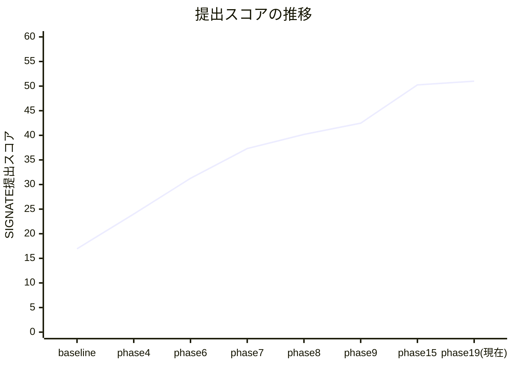
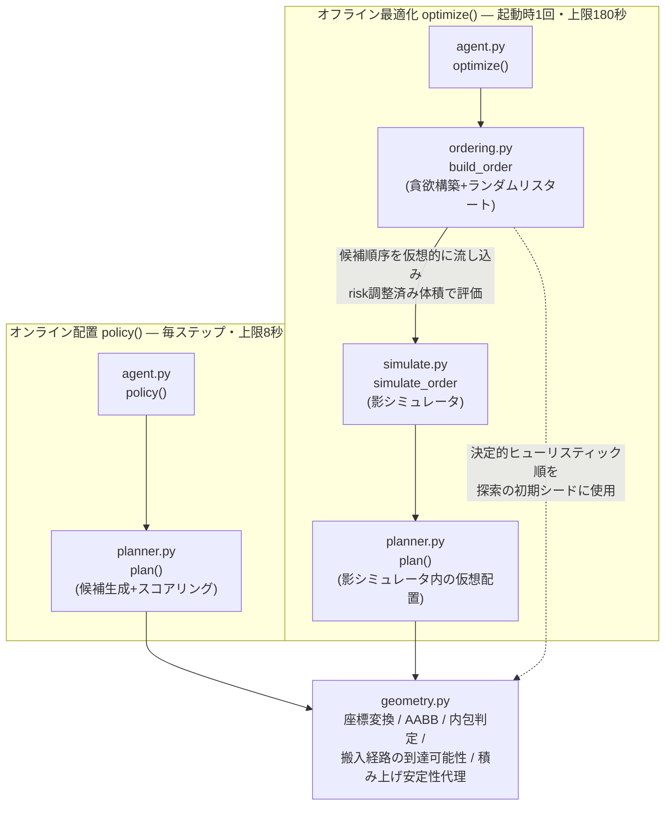

# 非凸コンテナ手荷物積付け最適化エージェント

NEDO Challenge コンテスト2「積付アルゴリズム」(SIGNATE)向けに開発した、空港手荷物を横空きコンテナへ自動積付けするエージェントの開発記録です。物理シミュレータ(PyBullet)上で合法手を保証しながら充填率・重心・安定性・優先荷物配置などの複数指標を最適化する探索アルゴリズムを、**仮説→検証→採否判定**のサイクルで25フェーズにわたり改善してきました。

本READMEは成果のハイライトです。各フェーズの詳細な仮説・実験・数値根拠は [`results/phase10_report.md`](results/phase10_report.md) 〜 [`results/phase28_report.md`](results/phase28_report.md) にすべて残しており、本文中の主張はすべてそこに1次データがあります(コードは評価基盤の性質上 `agents/mysolver/` を公開していますが、コンテスト公募要領そのものの転載は避けています)。

> ### 開発体制について(重要)
>
> **本プロジェクトはAI支援開発です。** 各フェーズの指示(仮説・ターゲット・判定基準・禁止事項)を Claude for Mac で作成し、実装・計測・報告書作成を Claude Code が行う、いわゆるバイブコーディングで進めています。コードとフェーズ報告書の文面は基本的にAIの出力です。
>
> そのうえで、このリポジトリで人間が担っているのは次の部分です。
>
> - **どこを次に測るかの意思決定**: 「代理誤差を測れ」(Phase20)「計上漏れを分解しろ」(Phase21)「空き体積を分解しろ」(Phase22)といった探索方針の選択。閉じた方向を再訪しないよう、フェーズごとに禁止事項を明示。
> - **判定基準を先に固定すること**: 「26シーンでノイズ床±0.90を超えたら採用」「placement/soft は全シーン満点」など、結果を見る前に採否ルールを決める運用。
> - **規律の強制**: 単一シーンでの較正を禁じ26シーンでの過適合チェックを必須にする、複数定数の同時変更を禁じる、といった実験計画上の制約。これらは実際に Phase18・Phase19 で誤った採用を防いでいます。一方 Phase23(ビームサーチ採用)はこの規律をすり抜けました——26シーン平均は+1.95ptの改善でしたが、実際の提出フィードバックは−0.45ptの悪化でした。Phase25aでシーン別効果の分散を測り直すとt=1.62(採用の目安t>2に届かず)で、**「26シーン平均の改善」という基準自体が不十分だった**ことが判明しています。
>
> 逆に言えば、本リポジトリが示しているのは「コードを自力で書く力」ではなく、**測定設計・仮説の棄却・採否判断を規律をもって回す力**です。都合の良い結果だけでなく、棄却された仮説や実装ミスの発見過程・**自分たちの採否基準そのものの誤りの発見**([§4-4](#4-4-棄却した仮説の記録)・[§4-6](#4-6-空き体積62の分解と自分の仮説を測定で否定した話phase22)・[§4-9](#4-9-自分の測定を測り直して42の過小評価を見つけた話phase24)・[§4-10](#4-10-phase23の誤った採用をシーン別分散の統計で検出し採否基準を作り直した話phase25a))もそのまま残してあります。

---

## 1. 概要

このコンテストの課題は、**非凸な形状のコンテナに、逐次到着する手荷物をオンラインで積み付ける**というものです。単純な3D Bin Packingと比べていくつかの点で難易度が高くなっています。

- **コンテナが非凸**: 横空き(手前に開口部)、内部に棚、斜めに切り欠かれた開口部など、単純な直方体ではない領域に対して合法配置を判定する必要があります。
- **到達可能性制約(搬入経路)**: 荷物は必ず手前の開口部からY軸方向→X軸方向へ「まっすぐ押し込む」軌道で搬入されます。目標位置が幾何学的に空いていても、そこへ至る経路上に他の荷物があれば配置は不合格になります。この制約は「体積が入るか」だけでなく「今どういう順序・配置で積んだか」全体の履歴に依存するため、素朴な貪欲法では自分自身の積み方で後続の搬入経路を塞いでしまう(自己封鎖)という罠があります。
- **Sudden death方式の評価**: 各ステップで内包判定・搬入経路判定・配置安定性判定のいずれか1つでも不合格になった瞬間にエピソードが終了し、その時点の状態で採点されます。1手の失敗が残り全荷物の機会損失に直結するため、「置ける手を確実に置ける形で選ぶ」保守性と「積極的に詰める」効率性のバランスが要求されます。
- **5指標のブラックボックス評価**: 最終スコアは充填率・重心・配置(優先荷物/ソフト貨物)・安定性の加重平均ですが、重みは非公開、配布されている評価コード(`src/ground_handling/evaluator.py`)も充填率しか算出しません。開発側は「何を最適化すれば本番スコアが上がるか」自体を実験的に推定する必要がありました。

これらの制約下で、**貪欲構築+リスタート探索によるオフライン順序最適化(`optimize`)**と、**候補生成+スコアリングによるオンライン配置決定(`policy`)**の二段構えのエージェントを実装し、探索の決定性・評価基盤の信頼性・目的関数の妥当性という3つの軸で継続的に検証・改善を行いました。

---

## 2. 成果

SIGNATE提出フィードバックで確認できたスコア推移です(リポジトリに記録が残っている提出のみを掲載。phase10〜14/16〜18は主にローカル評価スイートでの計測・仮説検証フェーズで、都度の提出は行っていません)。

| # | 提出スコア | 対応コミット | 主要な変更点 |
|---|---|---|---|
| 1 | 16.94 | baseline (`95de6e1`) | 合法貪欲ベースライン(候補生成+AABB近似の衝突判定) |
| 2 | 24.01 | phase4 (`467ae45`) | オフライン(影)物理シミュレーションで順序を事前検証 |
| 3 | 31.26 | phase6 (`d145aa3`) | 衝突判定バグ修正 + optimize予算30秒化 |
| 4 | 37.31 | phase7 (`4d8a1d7`) | 打ち切り考慮の順序探索 + リトライ機構 |
| 5 | 40.18 | phase8 (`fb8d80a`) | 体積(risk調整済み)優先の目的関数に回帰 — 足切り仮説を実測で棄却([§4-4](#4-技術的ハイライト)) |
| 6 | 42.47 | phase9 (`1ed528b`) | Y層規律 + 複数戦略の順序探索 |
| 7 | 50.25 | phase15完了時点 (`2689211`) | 26シーン評価スイート構築(phase10)、優先コンテナ席取り+prepacked fill回収(phase11)、corridor_penalty採用(phase14)、棚下/棚上コンパートメント分離(phase15)などの累積 |
| 8 | 51.00 | 現在, phase19 (`0462cf4`) | 決定性リファクタ(phase17)、到達不能候補の早期枝刈り+増分キャッシュ(phase19)などの累積 |



phase4〜7の間はローカルfillと提出スコアがほぼ線形に連動しており(`score ≈ 3×fill − 36`、`agents/mysolver/ordering.py` にこの回帰式を残している)、当初はローカルfillの改善だけを追っていれば良い状態でした。phase10で26シーン評価スイートを作って初めて、**固定6シーンでの改善が本番の出題分布に転移していない**(過適合)ことが判明し、以降は26シーン単位での評価に切り替えています([§4-3](#4-技術的ハイライト))。

**その後の提出フィードバックでは、この26シーン単位の評価にも限界があることが分かりました。** Phase19(51.00)以降のフェーズでも提出は継続しており、Phase23前後では直近3フェーズでnet −0.75の後退(publicベストはPhase16時点の51.30)が確認されています。その後 Phase25a で構成を現状復帰させ、探索予算 `UNITS_PER_SEC` をpublicで直接スイープした結果、**1.55e7 / 2.0e7 / 2.5e7 / 3.0e7 → 53.61 / 53.64 / 53.42 / 53.39** となり、現在のpublicベストは **53.64**(`UNITS_PER_SEC=2.0e7`)です。このスイープは同時に「**探索予算は既に飽和しており、増やすとむしろ悪化する**」ことを示しています。原因はoptimizer's curse——代理関数の順位相関がSpearman 0.71しかないため、候補を増やすほど代理が過大評価した候補を引く確率が上がります。とくにPhase23(ビームサーチ b=3採用)は26シーン平均で fill_strict +1.95pt という明確な改善に見えましたが、実際の提出は −0.45pt の悪化でした。原因はシーン別効果の分散の大きさで、Phase25aで統計的に検証しています([§4-10](#4-10-phase23の誤った採用をシーン別分散の統計で検出し採否基準を作り直した話phase25a))。26シーン平均という一次元の指標だけでなく、シーン別の標準偏差σ・標準誤差SE・t値を必須で報告する採否基準に改訂し、Phase25aでは提出スコアの後退分を取り戻すためBEAM_WIDTH=1(Phase22相当)へ現状復帰しています。

---

## 3. アーキテクチャ



| モジュール | 役割 |
|---|---|
| `agent.py` | 評価基盤との契約点(`get_init_states`/`optimize`/`policy`)。`policy`は毎回`observation`から状態を再構築し、前ステップの内部記憶に依存しない(タイムアウト時にプロセスが再起動されるため)。 |
| `geometry.py` | ローカル/ワールド座標変換、回転後半寸法、内包判定、既配置荷物・棚のAABB算出(クォータニオンからの実姿勢考慮)、搬入経路の到達可能範囲の算出、積み上げ安定性の幾何代理(質量比・支持凸包へのCoG投影余裕)。 |
| `planner.py` | 候補位置生成(グリッド+Extreme Point)、着地面(skyline/union支持)判定、搬入経路の合法性フィルタ、スコアリング(`corridor_penalty`等)、探索打ち切りを管理する`SearchBudget`(ユニットベース予算)。オンライン・オフライン両方から呼ばれる中核モジュール。 |
| `ordering.py` | `optimize`用の完全順列を生成。決定的ヒューリスティック(体積降順など複数戦略)を初期シードに、`simulate.py`経由で評価しながら貪欲構築+ランダムリスタートで改善する。 |
| `simulate.py` | 実物理エンジンを起動せず`planner.plan`を仮想的に繰り返して候補順序のrisk調整済み体積を見積もる「影シミュレータ」。offline探索のコストを抑えつつ、実配置と同じ合法性判定ロジックで評価できる。 |
| `tools/scorer.py` | 開発時専用。配布評価コードが算出しないcog/stability/placement/soft_itemの4指標をREADME仕様に沿って近似算出するローカルスコアラー([§4-3](#4-技術的ハイライト))。 |
| `configs/gen/` | パターンA/B/C×コンテナ数×棚有無×優先コンテナ×初期状態(空/既積み)を網羅する26シーン評価スイートの生成物・生成スクリプト(`tools/gen_scenes.py`, `tools/gen_suite.py`)。 |

---

## 4. 技術的ハイライト

各項目は「問題 → 仮説 → 検証 → 結果」の順で記載しています。詳細な数値・生ログは各phase報告書にあります。

### 4-1. 搬入経路の自己封鎖の発見と corridor_penalty(物理式から不感帯を導出)

**問題**: 26シーン評価スイートでの停止理由の内訳を見ると、体積利用率20〜30%台のまま行き詰まるシーンの大半で`fail_transport_y`(搬入時のY方向掃引での衝突)が支配的だった。荷物は常に手前(y=−width/2)から入り、Y→Xの順で「まっすぐ押し込む」軌道でしか搬入できない。

**仮説**: 「手前側に高い荷物を積んでしまうと、その奥にある(まだ空いている)低い天面へアクセスする経路を自分自身で塞いでしまう(自己封鎖)」という仮説を立て、「手前ほど天面が低い階段状のプロファイルを保てば、奥への経路は原理的に塞がれない」という設計に落とした。

**検証**: 候補の天面が「同一Xレーンで自分より奥にある障害物の最低天面」を超える超過量にペナルティを課す`corridor_penalty`を実装。まず不感帯なしで決定的な5シーン(パターンB)で重みを掃引したところ、W=2.5で19.46、W=3.0で23.21、W=4.0で23.50と**カオス的に振れ、W>0全体の平均は無変更と統計的に区別できなかった**。原因を掃引の幾何計算式から追跡すると、実際には搬入経路がまだ生きている「物理的に無害な高さ差」の範囲が存在していた:

```
不感帯 = REST_CLEARANCE(0.016) + START_Z(0.08) − SWEEP_Z_MARGIN(0.0155) = 0.0805 [m]
```

この値は調整可能なハイパーパラメータではなく、着地面からの静定クリアランス・搬入時の浮上高さ・掃引時に要求されるz方向余裕という3つの物理定数から一意に決まる。不感帯を導入すると重み応答は滑らかな単峰カーブに変わり、W∈{3, 6, 12}のすべてで両レジーム(厳/緩マージンの充填率)が改善した。

**結果**: 26シーン×3回平均でfill_strict 22.39→23.33、fill_loose 36.62→37.16(いずれもノイズ床を超えて改善)。診断ツールで機序を直接確認したところ、`fail_transport_y`の発生率がB01で22.5%→3.1%、`gen_manyitems_patternA`で46.0%→15.7%に低下しており、「スコアが偶然良くなった」のではなく「詰まりが実際に減った」ことを裏づけた。その後、既積み荷物の層を過剰に保護してしまう副作用(prepackedシーンでのfill低下)が判明し、corridor_penaltyの障害物集合からエピソード開始時の既積み荷物を除外する修正で大部分を回収した。

### 4-2. 決定性リファクタ — 壁時計依存の非決定性を診断し、ユニットベース予算に置換

**問題**: オフライン探索(`ordering.build_order`)の打ち切り判定が`time.perf_counter()`ベースの壁時計デッドラインだったため、同一シーン・同一コードでもCPU負荷によって異なる乱数列・探索経路を辿ってしまい、A/Bテストの当落判定が困難だった(あるシーンを5回実行するとfill_strictのstdが5.25に達した)。予算(秒)を増やしても結果が単調に改善しない非単調性もあった(budget別スプレッド最大13.4pt)。

**仮説**: 打ち切り条件の表現を壁時計から「消費した評価コスト(ユニット)」の決定的な会計に置き換えれば、同一入力に対して常に同一出力になり、予算を増やせば以前の探索の"接頭辞"を保ったまま単調に深く探索できるはず。

**検証**: `planner.SearchBudget`という予算オブジェクトを導入し、候補評価・候補構築のコストを実測較正した換算定数(`UNITS_PER_SEC`, `CANDIDATE_BUILD_COST`)で秒→ユニットに変換。全階層(`_search_best`/`plan`/`simulate.simulate_order`/`ordering.build_order`)の打ち切りをユニット消費で統一し、壁時計は「較正」と「非常用の最終安全弁(本番タイムアウトを絶対に踏まないための保険)」の2用途のみに限定した。最初の実装(打ち切りだけ決定化)ではリスタート予算の配分自体が総予算に比例していたため、予算を変えると"別の探索系列"を辿ってしまい単調性は回復しなかった(スプレッドはむしろ5.33→6.76に悪化)。1リスタートへの配分を総予算に依存しない固定値にし、「満額の枠が入らないリスタートは始めない」ことで、予算違いのリスタート系列が互いに接頭辞になる構造を作って解決した。

**結果**: 同一シーンの5回追試で、fill_strict/fill_loose含む全6指標のstdが**5.25 → 0.0000**に(実所要時間は依然として最大約4割ばらついたが、出力は完全に一致した)。budget再掃引でのシーン単位スプレッド平均はstrict −58%/loose −65%、隣接予算間での非単調(悪化)回数はstrict −70%/loose −69%、21シーン中10シーンでスプレッドが厳密に0.00(=best-of-Nの理論通りの挙動)になった。副産物として計測コストが約1/3になり(3回平均が不要になりrepeats=1で十分)、以降のフェーズでより広い掃引・多くの候補比較に予算を回せるようになった。

なおこの決定性は、それまで乱数に埋もれて間欠的にしか現れなかった弱点(旧6シーンの1つで安定性制約97以上を96.87で恒常的に下回るケース)も同時に可視化した。原因は影シミュレータの目的関数が改善する一方で実際の充填率・安定性は悪化する順序に収束していたためで、「決定化が問題を作った」のではなく「代理目的関数の誤差を常時再現可能にした」というのが正確な整理である。

### 4-3. 評価がブラックボックスである中での自作5指標スコアラーと26シーン評価スイート構築

**問題**: 配布評価コード(`src/ground_handling/evaluator.py`)は充填率(fill_score)しか算出しない。本番の合成スコアは5指標(fill/cog/placement/soft/stability)の加重平均だが重みは非公開。さらに開発初期(phase4〜9)は固定6シーンのみで開発しており、シーンごとのばらつきや代表性を検証する手段がなかった。

**仮説**: (1) 固定6シーンは本番の出題分布より系統的に易しく、そこでの改善が本番へ十分転移していないのではないか(過適合仮説)。(2) fillの改善がcogの悪化で相殺されているのではないか(cogトレードオフ仮説)。

**検証**: README「評価指標」の定義に忠実な近似ロジックで自作5指標スコアラー(`tools/scorer.py`)を実装(fillは本家`Evaluator`をそのまま利用し、cog/stability/placement/soft_itemの4指標は独自に近似実装)。あわせてパターンA/B/C×コンテナ台数×棚有無×優先コンテナ×荷物数(6〜140)×分布(小物/高密度/柔軟貨物/優先重多 等)×初期状態(空/既積み)を網羅する26シーンの評価スイート(`configs/gen/suite_*.json`)を構築し、9シーン×5回計測で反復ノイズの床(fill ±0.90pt/cog ±0.67pt/stability ±0.09pt)も定量化した。

**結果**: 26シーン平均fillは16.33±4.59で、旧固定6シーン平均23.70±0.45より7.37pt低く、旧集合が系統的に易しかったことが実証された(過適合仮説を支持)。一方cogトレードオフ仮説は、提出履歴からの重み再構成でcog係数がbaseline1点の有無で+3.98→+0.48と激変することから支持されないと判定した([§4-4](#4-技術的ハイライト)にも関連)。以降のすべての意思決定はこの26シーンスイートを主KPIとして行っている。

### 4-4. 棄却した仮説の記録

失敗した仮説とその検証プロセスも、成功した変更と同じ重みで記録しています。

| 仮説 | フェーズ | 検証内容 | 結論 |
|---|---|---|---|
| **足切り仮説**: 「一定数以上積載しないとfill以外0点」という評価仕様から、まず配置個数の足切りラインを確保してから体積を最適化する二段階の目的関数が有効なはず | Phase7→8 | 実際に二段階目的関数で提出したが、スコアは動かなかった。回帰分析で公開スコアはローカルfillとほぼ線形(`score ≈ 3×fill − 36`)と分かり、個数ではなく体積が支配的だと判明 | **棄却**。体積(risk調整済み)優先の目的関数へ差し戻し |
| **cogトレードオフ仮説**: fillの改善がcogの悪化で相殺され、公開スコアが伸び悩んでいる | Phase10 | 提出履歴6点の重み再構成でcog係数+3.98を得たが、baseline 1点を除いた5点では+0.48まで激減。stab/place/softは全提出でほぼ一定で識別に寄与せず | **支持されない**。公開スコアはfillでほぼ説明でき、cogの独立寄与は誤差と不可分 |
| **Y_SLICE構造(奥/手前の層分割)への介入**: 層の開放条件を変えれば搬入経路の詰まりを解消できる | Phase9, 13, 14, 26 | 固定4分割(Phase9・小物が最も狭い層を埋めて逆効果)、到達高さでの強制開放(Phase13・奥半分を使い切る前に手前へ展開)、棚シーンでの分割無効化(Phase14・標的シーン自身が悪化)を試し3回とも悪化。Phase26では**Phase9の失敗要因(厚みが荷物サイズと無関係な固定値)を特定したうえで厚みを荷物サイズ分布から決め直した**壁積みを実装したが、26シーンで fill_strict **−2.96(t=−2.29)** と**有意に悪化** | **4連敗で打ち切り**。「探索構造をいじるより、スコアリングに罰則項として載せる方が安全」という設計方針を得た(4-1のcorridor_penaltyが対照的に成功した理由) |
| **単一大域重みによるstability幾何代理の較正**: 質量比リスク・CoG投影余裕を目的関数に組み込み、1つの重みで安定性制約違反を解消できる | Phase18 | 標的シーンではW=2.5で制約を回復したが、26シーン過適合チェックで無関係シーンのfillが−18.36・placementが制約違反(100→85.71)に悪化。さらにW=1.1→1.2で標的シーンが修正される一方、別シーンはW=1.1の時点で既に破綻しており、**両方を同時に満たす重みの区間がそもそも存在しない**(崖の位置がシーン間で逆転) | **単一大域重みでは較正不能と判断し不採用**。デフォルト重みを0(数式的に旧実装と完全等価なno-op)に戻し、trust region + ρ-testのような候補ごとのgating設計を次フェーズへ申し送り |
| **空き62%は細切れの空隙で、探索の解像度を上げれば拾える**: 行き詰まり時の空き体積は小さなポケットの集合で、グリッド密度を上げれば入る荷物が見つかるはず | Phase22 | 空き連結成分は26シーンで36個・中央値2.18m³・全て1.0m³以上=**細切れではなく1つの大きな空洞**。さらに強い探索が拾えた6.932m³は、**密度4のままでも全量到達可能**(解像度は律速でない)で、poolをlookahead_k個に制限すると**69%が消失**=正体は荷物選択の自由度だった。26シーンA/Bでも密度4→8は改善0/悪化3 | **両方とも棄却**。細切れ前提の打ち手は対象が存在せず、解像度引き上げは予算を食って逆効果。取りこぼしは順序側でしか回収できないと確定 |
| **計上漏れ36%は未開拓のレバー**: 置けた体積の36%が充填率に計上されていないので、これを回収すれば大幅に伸びる | Phase21 | 26シーン574件の全数監査で原因を体積分解した結果、**96.4%が「床直置き」という構造的要因**(床面が99.7%)。傾き・棚接触・押し出しは**すべて0.0%**。床層は土台として幾何的に必要で、最薄構成の下界13.3m³に対し目標0.85は8.1m³を要求 → **幾何的に到達不能**。残る上限+4.24ptの機序(薄物を床へ)も手組み順序の実測で棄却(置けた体積が29%崩壊) | **「レバー」ではなく指標の構造と判明**。充填率 ≒ 置けた体積 × 0.63 で、計上率は独立に動かせない。この方向を打ち切り、レバーは「置けた体積を増やすこと」に戻ると確定 |
| **搬入経路の封鎖は順序探索側なら解ける**: `corridor_penalty` の myopia(既に置かれた障害物の上の通路しか守れない)は、順序を最後まで流し切る影シミュレータなら事後観測で外せるはず | Phase28 | Phase24の厳密判定を`agents/mysolver/reach.py`へ移植(5マスク完全一致で検証)し、行き詰まり時点の「支持はあるが経路が死んでいる割合」で目的関数を乗算割引。26シーンで **+0.350(t=+1.000)**。動いたのは**1シーンのみ**で残り25はビット単位で不変。原因を`tools/phase28_rerank.py`で定量化: **再ランク閾値がシーンごとに0.23〜2.29と10倍散らばり**、最小閾値のシーンは W=1.0 で既に崖から落ちる=**共通の重み区間が存在しない** | **不採用**。Phase18と同型の結論が別の項で再現。さらに再ランクは必ず配置個数の少ない順序を選ぶ(21→4等)= **「通路を開ける」と「たくさん詰める」は原理的に競合**すると判明 |
| **厳マージンと緩マージンの差 12.18pt は未着手のレバー**: 同一配置を厳(−0.005)と緩(+0.01)で採点した差が12.18ptあり、採点モデル換算で7.3 public相当。壁積みでこの差が+4.20動いたので操作可能な量のはず | Phase27 | 配布ソースを照合するだけで決着。(1) 自作スコアラは独自の内包判定を持たず公式`Evaluator`に委譲しており、マージン取得経路も公式`env.py`と同一で**乖離は無い**。(2) 公式の面リストには**内床面が含まれ**、床面判定は `dot = zi − corner_z` なので計上には**床から5mm以上の浮上が必要** — **貫入量が0でも除外される**(沈み込みの問題ではなくマージン演算の帰結)。(3) `env.py:51` の配線上 evaluator と validator は**常に同じmarginを共有**するため、厳の世界では回収不能・緩の世界では既に計上済み | **どちらの世界でもプールにならないと確定**。`fill_loose`は別の到達可能な状態ではなく同じ配置の別の目盛りであり、**2つを独立に追える目標として扱うのが誤り**だった。計測実行0回で打ち切り |
| **代理関数の較正を直せば探索の質が上がる**: 影シミュレータのfill計上予測を物理的に正しい「沈降後の姿勢」で評価し直せば、目的関数が実評価に近づき順序選択が改善する | Phase20 | 較正は劇的に改善(計上割合の誤差 +0.141→−0.049、fillの系統バイアス +4.02pt→−1.75pt)。**しかし順位相関は改善せず**(native Spearman 0.710→0.690、改善は8シーン中2つ)。原因を分解して特定: 代理誤差は「シーンごとの一定の下駄(較正誤差)」と「候補ごとのばらつき(弁別誤差)」からなり、修正が消したのは前者だけ(**弁別誤差 0.075→0.075 と不変**)。`build_order`は同一シーン内の順位しか使わないため、全候補共通の下駄は定義上どんな決定も変えない | **不採用**(26シーンでfill_strict +0.13=ノイズ内、fill_loose −1.00、stability新規違反)。同時に「**risk_factorの定数・形状をどう調整しても順位は改善しない**」という構造的結論を得て、代理関数改良路線そのものを打ち切り |

途中で一度「本番評価のinclusion_marginレジーム(厳/緩)を提出フィードバックとの突き合わせで確定した」と結論したことがありましたが(Phase12)、後にその根拠が自分たちの過去のローカル計測値との**循環参照**だったと気づき撤回しました(Phase13)。以降は「レジームが判別できない前提でも両方(fill_strict/fill_loose)とも改善する変更だけを採用する」という、ブラックボックスに対して頑健な意思決定基準に切り替えています。

### 4-5. 評価指標の構造そのものを測る: fill計上漏れの原因分解(Phase21)

**問題**: 「置けた体積のうち充填率スコアに計上されるのは0.629」——約36%が計上されていない。額面どおりなら最大のレバーに見える。

**仮説**: 計上漏れの原因を(a)床直置き (b)沈降後の傾きによる壁・天井への接触 (c)棚接触 (d)他の荷物に押されての移動 に分解すれば、狙って潰せるはず。

**検証**: 配布評価コードの判定式(荷物の8角点×コンテナ7面の内積)を再現し、26シーン・配置済み574件を全数監査。「どの面をどれだけ超えたか」で相互排他に分類し、**件数ではなく体積シェア**で集計しました(充填率は体積ベースのため)。

**結果**: 原因は極端に一極集中していました。**(a)床直置きが96.4%**、面別では**床面が99.7%**。一方 **(b)傾きは0.0%** — これは「小さい」のではなく原理的に起きていません(574件の傾き角は最大3.72°、5°以上は0件、天井・切り欠き・側壁による除外は1件も無い)。機序も厳密に特定できました: 床面の判定は `dot = thickness − bottom_z` なので、軸平行の荷物が内床面に接地すると `dot = 0` となり `0 > −0.005` で必ず除外される。**計上されるには床から5mm以上浮いている必要があり、物理沈降は必ず支持面まで落とすため床接地荷物は構造的に永久に計上されません。**

この分解は、当初の見立て自体を否定しました。床層は積み上げの土台として幾何的に必要で、実測の被覆率(53.3%)を維持したまま手持ちの最も薄い荷物で床を作った場合の**下界が13.3m³**。「計上率0.85」は床層8.1m³を要求するので**幾何的に到達不能**であり、36%のうち約2/3は削減不能な土台コストでした。残る上限+4.24ptを取りにいく唯一の機序(薄い荷物を床に、厚い荷物を上へ)も、**エージェント無改造のまま手組み順序を実エピソードに流して直接検証し棄却**しました(床層は薄くなるが置けた体積が2.491→1.768m³に崩壊し、充填率は改善しない)。結論として、充填率スコアは実質「置けた体積 × ほぼ一定の係数0.63」であり、計上率は独立に動かせるレバーではないと確定しました。

### 4-6. 空き体積62%の分解と、自分の仮説を測定で否定した話(Phase22)

**問題**: 充填率スコアの唯一のレバーが「置けた体積」に絞られた結果(Phase21)、体積利用率37.8%の裏返しである**62%の空き**が次の標的になりました。これは埋められる空隙なのか、それとも埋まらない空間なのか。

**仮説**: 空き体積を(a)搬入経路が塞がれて到達不能 (b)どの荷物も入らない細切れの空隙 (c)入る荷物があるのに探索が見つけられなかった (d)コンテナ形状で構造的に使えない に分解すれば、打ち手が決まるはず。

**検証**: 行き詰まり状態を2.5cm voxelに離散化し、残荷物×全向きについて3D積分画像で「その直方体が完全に空voxelへ収まる位置」を全列挙して、`covered`⊇`supported`⊇`reachable`の入れ子マスクを構成しました(膨張は累積和による分離可能な窓走査でO(N))。**(c)だけはvoxel近似ではなく production の実コード `planner.plan` で測定**しています——「置けるはず」と近似で主張するより、実際の合法性判定コードで置けることを示すほうが証拠として強いためです。独立な2経路(voxel由来の上界0.08m³ / 実コード実測0.074m³)が一致したことで測定機構の妥当性も確認できました。

**結果**: まず**空隙の形状についての仮説が外れました**。空き連結成分は26シーンで**わずか36個**、中央値2.18m³、全成分が1.0m³以上——**細切れではなく、コンテナごとに1つの大きな空洞**でした。「細切れを埋める」系の打ち手は対象が存在しません。

そしてより重要なこととして、**自分の一次解釈を追試で否定しました**。強い探索が追加配置できた6.932m³(+4.82pt)を当初「グリッド解像度の取りこぼし」と解釈し、単一定数`RETRY_GRID_DENSITY`の引き上げを検証にかけました。しかし採用判断の前に内訳を切り分けたところ、**密度4のままでも同じ6.932m³に到達でき(解像度は律速ではない)**、一方で**pool を online と同じlookahead_k個に制限すると69%が消える**ことが判明しました。つまり取りこぼしの正体は「どの荷物を置くか選べる自由度」であり、オンライン探索をどう強化しても原理的に取れず、順序側でしか回収できません。26シーンA/Bでも密度引き上げは改善0/悪化3で不採用となり、コードは既定値のまま据え置きました。

副産物として理論上界も算出しました。`min(幾何上限97.8%, 荷物供給量)`で集計すると実効上界は**90.4%**(荷物供給が律速のシーンが26中10件)。現状の37.8%は**上界の41.8%**の位置にあります。

### 4-7. 到達点: 順序探索のビームサーチ化で fill +1.95pt(Phase23)

**問題**: Phase20・Phase22 の測定が同じ結論を指していました——「見た候補の中ではほぼ最良を選べている」(regret 1.14pt)が「良い候補を生成できていない」(順序による充填率スプレッド19.19pt、取りこぼしの7割が荷物選択の自由度由来)。つまり**候補の選び方ではなく作り方**が悪い。

**仮説**: 1本の貪欲構築を幅bのビームサーチに一般化すれば、より良い順序を生成できる。

**検証**: ここで最大の設計上の勘所は**コストの抑え方**でした。素直に「上位k個の荷物選択を展開する」と探索を k 回呼ぶことになり1手あたりコストが k 倍になります。これは Phase22 で「1手あたりコストを増やすと予算内で回れる組合せが減って逆効果」と実証済みの失敗の再演です。そこで、探索が元々 (荷物×向き×位置) を総当たりして argmax を取っている点を利用し、**「荷物ごとの最良手」を控えるだけ**にしました。探索1回で上位k手が得られるので、展開コストは b×k 回ではなく **b 回**で済みます。

実装の正しさは **b=1 が既存の貪欲と完全一致すること**で担保しました(6シーン×3条件で18/18の順序一致、さらにb=1の実測値がPhase22ベースラインを8/8完全再現)。

**結果**: 幅を掃引したところ、8シーンでは b=2 が最良に見えましたが **b=2 は placement を92.86に落とし制約違反**、b=5 も85.71で違反。制約を満たす b>1 は **b=3 のみ**でした。26シーンで検証すると **fill_strict 23.74 → 25.68(+1.95)、fill_loose 36.65 → 39.13(+2.48)**、placement/soft 全シーン満点維持。採点モデル換算で **public +0.87pt** の純増となり**採用**しました。

このフェーズでは実装上の落とし穴を3つ潰しています。とくに危険だったのは、子ごとにコンテナを複製すると1ステップ b×k 回の複製が発生し、**その費用はユニット予算に計上されないため壁時計だけが膨らんで安全弁が発火し、Phase17で確保した決定性が壊れる**というものでした(上位b個に絞ってから複製する形に変更)。また「効くはずだ」と考えて追加した placement ペナルティ項が、**実測では結果が1桁まで不変=構造的に不活性**だったことも記録しています。

副産物として当初の描像も訂正されました。「取りこぼし(c)を回収する」つもりでしたが、置けた体積が +2.496m³ 増えた一方で **(c) 自体は7%しか縮まなかった**——(c) は汲み出せば減る在庫ではなく、より多く積んだ新しい行き詰まり状態で同じくらい再生成される**状態依存の量**でした。

### 4-9. 自分の測定を測り直して42%の過小評価を見つけた話(Phase24)

**問題**: Phase22 の空き体積分解で「(a)搬入経路の封鎖 = 空きの26.7%」が最大の未着手レバーとして残っていました。ただしその測定は自ら**楽観近似**と断ってあり(荷物が搬入時に`START_Z`=80mm持ち上がることを無視)、真の大きさは不明でした。

**仮説**: 搬入経路の判定を `validator.check_transport_path` と同式まで厳密化すれば (a) の真の大きさが分かる。さらに (a) を「その空間へ到達する荷物が浮上するか否か」で分ければ、現在の不感帯 `CORRIDOR_DEADBAND`=80.5mm が物理的に間違っている帯を特定できるはず——不感帯は浮上を前提にした値なので、浮上しない荷物(直置き面の0〜50mm上に着地する荷物)に対しては実効値がほぼゼロ(0.5mm)のはずだからです。

**検証**: 監査ツールを作り直し、無視されていた5要素(浮上量、天井による浮上量のクリップ、掃引時のz余裕15.5mm・xy余裕22mm、そして**x方向掃引そのもの**)をすべて validator と同式で再現しました。実装も変えています——Phase22 の「voxelを膨張させて判定する」方式をやめ、**支持まで通った候補位置を疎に取り出して、掃引箱と全障害物のAABB分離判定を連続座標で行う**方式にしました(搬入経路の判定から量子化誤差が消えます)。障害物集合を決めるにあたり、`validator._move_item` が**コンテナ壁とは当たり判定しない**(壁・切り欠きは搬入開始x座標の制限としてのみ効く)ことをソースで確認して一致させています。

**結果**: **(a) は 17.49 → 29.99 m³(空きの38.8%、fill換算13.14pt)で、楽観近似は42%の過小評価でした。** 空きの最大要因が (a) であることが確定し、同時に「支持もあり経路も生きている空間は4.26m³(5.5%)しか残っていない」——配置能力をいくら上げても (a) を開けない限り届かない——ことも分かりました。分解の結果は次のとおりです。

| 分類軸 | 内訳 |
|---|---|
| 帯域 | 浮上帯60.1% / **直置き帯39.9%(11.98m³ = 5.25pt)** |
| 障害物 | 既配置荷物のみ72.1% / 棚が絡む27.9% / **切り欠き由来 0.0%** |
| 経路上の障害物数 | 1個23.6% / 2個21.5% / **3個以上55.0%** |
| 位置 | 上位3割の高さに51.2%、奥半分に58.8%(**高くて奥**) |

**この測定は事前の仮説を1つ支持し、1つ否定しました。** 「不感帯80.5mmは浮上しない荷物に対して過剰」(穴1)は成立し、封鎖の39.9%がその帯にありました。一方「床置き荷物どうしの前後関係が未モデル化」(穴2)は**量的に小さい**(床直置き帯は(a)の7.5%、0.98pt)。Z分布でも床側3割は(a)の9.7%しかなく、**床は既に埋まっている**ためです。穴2の実体は床ではなく中間高さの帯で、これは穴1と同じ機序でした。

**対策と、その不採用**: 不感帯を「奥の天面の種類」から物理的に一意に決める形(直置き面なら0.5mm、それ以外は80.5mm)に一般化しました。新しい調整パラメータは増やしていません。既定モードが Phase23 と厳密に同一であることは**乱数300ケースで差0.0**、**26シーン実行でsuite平均fill_strictが小数第9位まで一致**の2重で確認しています。26シーンA/Bの結果は **fill_strict 25.68 → 25.95(+0.27)**——ノイズ床±0.90を下回り、しかも**改善1/悪化0/同値25で、全量が1シーン(P05, +6.90)から来ていました**。事前に固定した採否ルールどおり**不採用**とし、既定値は据え置いています。

**効かなかった理由も実行時に特定しました。** `_corridor_excess` をラップして候補単位で数えたところ、`corridor_penalty` 自体は評価候補の**49.4%**で発火している一方、不感帯の帯域別化が届くのは**5.97%**で、しかも**大棚を持つコンテナにほぼ限定**(大棚無しのシーンでは 0.00%)でした。原因は幾何にあります。拘束面は `min(天面 + その面の不感帯)` なので直置き帯の面が拘束するのは「最低天面の8cm以内」という狭い窓のときだけで、さらに常設の小棚は手前面がコンテナ最前面にあるため原理的に「奥」になりません。そしてより本質的には、**中間高さ帯の行き先の面は、その後の積み上げで初めて生まれる**——`corridor_penalty`は既に置かれた障害物の上の通路しか守れないので、**将来生まれる通路は原理的に守れない**(myopia)。不感帯をいくら正確にしても、この分は取りに行けません。この構造的限界の特定が本フェーズの実質的な成果です。

### 4-8. 到達不能候補の早期枝刈り+増分キャッシュ(Phase19)

**問題**: 決定性リファクタ後の実測較正(Phase17)で、候補生成(`_candidate_xy`)がplan()時間の58%を占め、候補評価(`_evaluate_candidates`)より重いことが分かった。

**仮説**: (1) 候補の(x,y)によらず一意に定まる搬入スイープ高さの範囲が、既存障害物のz遮断区間で完全に覆われている候補は、着地面の詳細評価より前の段階で厳密に(近似なしで)判定・除去できる。(2) グリッド点集合・既配置荷物のAABB・障害物リストは値ベース/増分キャッシュ化すれば、候補集合を数学的に一切変えずに構築コストだけ下げられる。

**検証**: (1)は24000件の合成ランダムケースで不一致0件、決定的な5シーンでエピソード全体のsha256 digestが完全一致することを確認。(2)は旧6シーン全11通り(offline最適化を経由するシーンを含む)でdigest完全一致を確認 — いずれも「出力を一切変えない厳密な最適化」であることを構成的に保証した。

**結果**: 清浄なワークロードでplan()時間 −21.2%(枝刈りのみ)、さらに枝刈り+キャッシュで −29.0%。この速度改善を踏まえてユニット予算の較正定数(`UNITS_PER_SEC`)も再較正したところ、片方だけの変更は安全な一方、**2つの定数を同時に変更した場合だけ**無関係シーンのplacementを制約違反に落とす「組み合わせの崖」を新たに発見した(単一パラメータの崖より一段厄介な現象)。指示範囲外だった定数の変更は見送り、範囲内の再較正のみを採用する保守的な判断をした。26シーン最終確認ではplacement/soft満点・stability全シーン97.26以上を維持しつつcogが+0.72改善。ただし速度改善分がそのままfillの明確な改善には直結しなかった(ノイズ床以内)ことも正直に記録している。

### 4-10. Phase23の誤った採用をシーン別分散の統計で検出し、採否基準を作り直した話(Phase25a)

**問題**: Phase23(ビームサーチ b=3)は26シーン平均で fill_strict +1.95pt という明確な改善があり採用した。しかし実際の提出フィードバックは **−0.45pt の悪化**だった。26シーン平均という一次元の指標だけで採否を決める運用そのものに欠陥があると疑い、検証した。

**仮説**: 26シーン平均の改善幅だけでなく、**シーン別効果のばらつき**を見れば「別シーン集合(隠しテスト)に一般化するかどうか」を事前に判別できるはずである。シーン間の分散が大きい変更は、平均が改善して見えても実は「一部シーンでの大幅な改善」と「一部シーンでの大幅な悪化」が相殺しているだけで、シーン集合が変われば結果も入れ替わりうる。

**検証**: シーン別のペア差分 d_i = after_i − before_i から、標準偏差σ・標準誤差SE=σ/√26・t値(=平均差分/SE)を算出するツール(`tools/phase25a_stats.py`)を新規作成した。まず Phase23(b=3)のデータをこの基準で**独立に再計算**したところ、**+1.95 ± 1.20(SE)、t=1.62** となり、目安(t>2)に届いていなかった。シーン別には +11.77(A03)〜−14.78(D01)まで符号が激しく反転しており、これが実際の public −0.45 に直結したと考えられる。

続けて BEAM_WIDTH を1(Phase22相当)へ戻したうえで、`UNITS_PER_SEC` を1.05e7(現行)と1.55e7(Phase17時点の値、Phase19で下げた経緯がある)で26シーンA/Bした。26シーン平均は fill_strict 23.74→24.41(+0.68)と改善して見えたが、**σ=5.07・SE=0.99・t=0.68** で明確に不採用。安全弁(HARD_WALL_LIMIT=165s)は1.55e7でも発火しておらず(最重量シーンの2反復再測定で fill_strict std=0.0000)、危険だから不採用にしたのではなく、**分散が大きく一般化する統計的根拠がないから**不採用にした点を区別して記録している。

**結果**: 「26シーン平均が改善したら採用」という従来基準を、「26シーン平均に加えてσ・SE・t(目安t>2)を必ず報告し判定する」基準に改訂した。BEAM_WIDTH=1・UNITS_PER_SEC=1.05e7(=Phase22相当の構成)を現状復帰の到達点として確定し、以後のフェーズはこの構成からのdiffで評価する。**採否基準そのものが、実際の失敗(Phase23の提出悪化)を受けて検証・改訂された**という意味で、本プロジェクトの「測定設計を規律をもって回す」姿勢が採否基準自体にも及んだフェーズである。

### 4-11. 壁積みの実装と、自分の中間計測が選択バイアスで結論を反転させていた話(Phase26)

**問題**: publicスイープで探索予算が飽和していることが判明し(§2)、「より多く探索する」方向が完全に閉じた。漸進的な改良もPhase20〜24でほぼ全て閉じている。残るのは**構築の仕方そのものを変える**ことで、コンテナの奥から手前へ壁を1枚ずつ積む決定的構築(壁積み)を試した。

**仮説**: 壁積みは「奥から系統的に埋める」決定的な構築なので、カオス的な候補集合から代理関数で選ぶ現在の構造を回避でき、optimizer's curseの影響を受けにくいはずである。Phase9が固定4分割で失敗した理由は README の課題表に「小物が最も狭い層を埋めて逆効果」と記録されていた——`width/4 = 0.3625m` の層には大きい荷物がそもそも入らないためである。荷物は6向き試されるので「厚み T の壁に入りうる」条件は `min(l,w,h) <= T` であり、**壁の厚みをプールの最小辺分布の分位点から決めれば**この失敗モードは構造的に消える。

**検証と、そこで自分が犯した誤り**: 決定的シーン(B01-B04, P04)では −2.59 と劣化したが、動いたのは2シーンだけで、かつこの群は `optimize` 無効=順序の事前検証が無い構造的に最も不利な群であるため、影響範囲を絞った計測へ進めた。ここで**「壁枚数が最大の4シーン」を標本に選んだ**ところ **+3.99(strict)/+12.41(loose)** と強い改善が出た。しかし26シーン全体では **−2.96(σ=6.58, SE=1.29, t=−2.29)** で、**基準 t>2 を負の方向に超える有意な悪化**だった。原因は標本の選び方にある——壁枚数が大きい ⇔ 小物中心のシーンであり、これは「壁積みが得意なシーン」と強く相関する。実際、26シーンでの大敗シーン(A08 −14.39, C03 −11.75, A07 −11.63, A04 −11.36)は**1つも標本に入っていなかった**。**効果の大きさで標本を選ぶと、効果の符号の推定が偏る**。

**失敗の分解**: 初期壁枚数 `n0` で層別すると、**本来まったく影響を受けないはずの `n0=2` 群が最悪**(−4.64, t=−2.27)という、設計の欠陥を直接指す結果になった。実装が壁の厚みを「その時点のプール」から計算していたため、大物から消費されると残りプールの分位点が下がり、**終盤に壁が勝手に薄くなってPhase9の失敗モードが再発**していた(壁の厚みはシーンの属性でありプールの属性ではない)。ただし汚染のない `n0>=3` 群も −1.51(t=−0.94)で符号は負であり、**修正しても改善に転じる根拠は無い**と判断して打ち切った。

**機序**: fill_**loose** は +1.25 と増えており(A01で +23.11)、壁積みは実際により多くの体積を詰め込んでいる。しかし loose−strict のギャップが **12.18 → 16.38** に開いた——増分がコンテナ境界から15mm以内に集中し、沈降後の厳マージン判定で計上から漏れる。壁積みは荷物を壁面へ押し付ける方向に働くためである。なお緩レジームでも t=+0.73 と基準に遠く届かないため、**本番の内包判定レジームが厳/緩どちらであっても結論は変わらない**。

**結果**: 不採用(既定は無効のままコードを残し、理由を定数コメントに記録)。ローカルで有意な改善が出ていないため**public提出による最終判定は行っていない**——Phase23の轍(ローカル t=1.62 を見誤って提出し public −0.45)を踏まないための基準であり、今回は基準どおり提出前に止めた。指示されていたフォールバック案(候補生成の走査順だけを変える)も実装したが、`_evaluate_candidates` が全候補をベクトル演算でスコアリングして `argmax` を取る現行アーキテクチャでは**並び替えは厳密同値の候補の選ばれ方しか変えない**ため、決定的5シーンで**ビット単位の一致**を確認して no-op と判定し、26シーン測定は行っていない。

### 4-12. 「7.3 public相当の未着手レバー」を、計測を1回もせずに閉じた話(Phase27)

**問題**: Phase26の副産物として、同一配置を厳マージン(−0.005)と緩マージン(+0.01)で採点した差が **12.18pt** あることが分かりました。採点モデル換算で **7.3 public相当**、目標60までの残り6.4を単独で上回ります。しかも壁積みでこの差が +4.20 動いたので、固定の物理定数ではなく操作可能な量に見えました。**このプールを取りに行くべきか**を判定するのがフェーズの目的でした。

**方針**: 全荷物の姿勢・8隅点・各面への符号付き距離をダンプする計装を入れ、26シーンで「あと何mm内側にあれば計上されたか」の反実仮想カーブを出す計画でした。ただし着手前に**配布されている公式ソースの内包判定規則を自作スコアラと突き合わせる**ステップを最優先に置きました。「自作スコアラだけが床面に厳マージンを適用しているなら、存在しないペナルティに最適化してきたことになる」ためです。

**結果: この照合だけで全ての問いに決着がつきました。**

1. **乖離は無い**。`tools/scorer.py` は独自の内包判定を持たず公式 `Evaluator` にそのまま委譲しており、マージンの取得経路も公式 `env.py:51` と同一でした。存在しないペナルティに最適化してはいませんでした。
2. **公式の面リストには内床面が含まれる**(`utils.py`: `points.extend([[0,0,z1],[0,0,zi]])`)。床面判定は `dot = zi − corner_z` なので、計上されるには**底面が床から5mm以上浮いている**必要があります。物理沈降は必ず支持面まで落とすため、**床接地荷物は構造的に永久に計上されません**。
3. **貫入(沈み込み)は原因ではありません**。貫入量が厳密に0でも、接地した瞬間に `dot = 0 > −0.005` で除外されます。これは沈み込みの問題ではなく**マージン演算そのものの帰結**で、事前に用意していた判定分岐の1つ(「貫入を減らすのがレバー」)は前提から成立しませんでした。
4. **決定打**: `env.py:51` の配線により `inclusion_margin` は**採点と合法性判定の両方を同時に動かします**。したがって margin=−0.005 の世界では床接地は回収不能、margin=+0.01 の世界では床接地は既に計上済み。**どちらの世界でも 12.18pt は取りに行けるプールになりません。**

**副産物**: Phase12〜13以来の未解決課題「本番の内包判定レジーム(厳/緩)が未確定」に部分的な前進がありました。レジームがどちらかは依然確定できませんが、**`fill_strict` と `fill_loose` を『独立に追える2つの目標』として扱うのは誤り**だと構造から確定しました。両者は同じ配置を別の目盛りで測った値です。

**このフェーズで一番価値があったのは、計測を1回も実行せずに済んだこと**です。計装ツールも集計ツールも書いていません。「実装する前に、まず配布されているソースが何を規定しているかを読む」という順序だけで、約1時間の計測と数百行の計装コードが不要になりました。なお調査の過程で、フェーズ着手時の前提だった「このレバーは未着手」「Phase21とREADMEの記述が矛盾している」の**2点とも事実誤認**であることも判明しています(Phase21が26シーン574件の全数監査で既に決着させており、README・報告書の記述は一貫して整合していました)。

### 4-13. 「1シーンしか動かない改善」は統計的に採用できないと分かった話(Phase28)

**問題**: 空きの38.8%(fill換算13.14pt)を占める搬入経路の封鎖は、Phase24で「`corridor_penalty` の枠内では解けない」と結論が出ていました。理由は**時間方向の myopia** —— `corridor_penalty` は候補1手ごとに、その時点の障害物に対してしか罰則を課せないため、封鎖の主因である「その後の積み上げで初めて生まれる通路」を守れません。Phase24 は解決の方向まで書き残していました: 影シミュレータは順序を最後まで流し切るので、**自己封鎖した結果を事後に観測できる**。

**実装**: Phase24 の厳密な経路判定(`validator.check_transport_path` と同式)を `agents/mysolver/reach.py` へ移植し、行き詰まり時点の「支持はあるが搬入経路が死んでいる割合」で順序の目的関数を割り引きました。設計で守ったことが3つあります。**(1)** 移植の同一性を専用ツールで検証(5マスクが voxel 単位で完全一致)。**(2)** 加算ペナルティではなく**乗算の割引**(Phase18 の「何も置かないほうが得」という退化解を繰り返さないため)。**(3)** コストを壁時計ではなく決定的な量でユニット課金(Phase17 の決定性を壊さないため)。評価は行き詰まり時点で1回だけ、voxel も 0.025m→0.10m へ粗くして 3.375s→0.106s に落としました。

**結果**: 26シーンで **+0.350、t=+1.000** で不採用。動いたのは **26シーン中1シーン(A03 の +9.10)** だけで、残り25シーンはビット単位で不変でした。

**t=1.000 は偶然ではありません。** 25シーンが0で1シーンだけが d のとき、mean = d/26、SE = σ/√26 = d/26 となり、**t は d の大きさに依存せず恒等的に 1.000 になります**。つまり**単一シーンしか動かさない変更は、そのシーンでどれだけ大きな改善が出ても採用基準 t>2 を原理的に通過できません**。これは基準の欠陥ではなく、「1シーンだけの改善は別シーン集合へ一般化する根拠にならない」という Phase25a の設計意図がそのまま働いた結果です。

**なぜ25シーンが動かなかったか(本フェーズの主成果)**: `build_order` が実際に評価した全候補順序をフックで記録し、**「採用される順序が変わる最小の重み W」**をシーンごとに直接測りました。結果は **0.23 / 0.39 / 1.04 / 2.29** と**10倍のばらつき**。しかも最小閾値のシーン(A03)は W=1.0 で既に崖から落ちてベースライン以下に悪化します。つまり「A03 が壊れる W」が「A02 が反応し始める W(1.04)」より小さく、**広く効く重みと、どのシーンも壊さない重みの共通区間が存在しません**。Phase18 が単一大域重みについて出した結論が、まったく別の項に対して独立に再現しました。

**さらに構造的な発見**: 再ランクが起きたとき、選ばれる順序は**例外なく配置個数が少ない**方でした(21個→4個、26個→10個、28個→19個)。荷物を1個置くたびに通路を塞ぐ可能性が生まれるので、**「通路を開けておく」と「たくさん詰める」は原理的に競合します**。分母を工夫して最悪の退化(fill が 0 に崩壊する Phase18 型)は防げましたが、弱い偏りまでは消せませんでした。この対立構造は、この方向の打ち手すべてに共通する制約です。

---

## 5. 開発方法論

- **診断駆動開発**: `tools/diagnose_placement.py`・`diagnose_prepacked.py`・`diagnose_shelf_zones.py`・`diagnose_stall.py`など、実際にエピソードを再現・走査して「なぜ失敗するか」を数値(内訳・件数)で特定してから修正する運用を徹底しました。スコアの動きだけを見て場当たり的にパラメータを触ることはしていません。
- **決定的シーンでの先行検証 → 26シーン統計検証の2段階プロトコル**: Phase13で「offline optimizeが有効なシーンは単発計測でstd ±5〜10ptに達する」ことを発見して以降、まず`optimize`無効(決定的)なシーンで重み掃引・仮説の方向性を確認し、方向性が出たものだけ26シーン評価スイートで最終判定する、という2段構えを標準化しました。Phase17の決定性リファクタ後は「repeats=1で十分・repeats=2は異常検知(較正が想定と乖離していないかの見張り)」という形にさらに進化しています。
- **ノイズ床の概念**: 9シーン×5回計測(Phase10)で「これ未満の差は意味を持たない」閾値(fill ±0.90pt / cog ±0.67pt / stability ±0.09ptなど)を確立し、以降すべての当落判定の基準にしています。26シーン平均でも別途ノイズ床を実測(Phase14)し基準を更新しています。
- **1提出=1変数の原則**: 複数の変更を1つのコミット/提出にまとめず、各フェーズで単一のターゲット(仮説)を検証してから次に進みます。旧6シーンでの局所的な改善だけで採否判断をせず、必ず26シーンスイートでの過適合チェックを通す運用を徹底しました(Phase18のように、旧6シーンだけなら成功に見えた変更を26シーンで検出して不採用にした例が複数あります)。

---

## 6. 学んだこと/今後の課題

**代理目的関数と真の評価の乖離**が、現在向き合っている中心的な課題です。オフライン探索(`ordering.build_order`)が最適化しているのは影シミュレータ上の「risk調整済み体積」であり、本番の合成スコアそのものではありません。Phase17でこのギャップが単一シーンで再現可能な形になり(安定性制約違反として顕在化)、Phase18で「単一の大域重みでこの誤差を埋めようとする」試みが、シーンごとに崖の位置が異なるため破綻することを実証しました。

Phase20では、この乖離を推測ではなく**直接測定**しました。8シーン×125候補について「影シミュレータの予測」と「その順序を実際に走らせた真のfill」を対にして計測した結果、順位相関はSpearman 0.710(探索が実際に評価する候補集合)、誤差の系統成分はほぼ全量が「置けた体積のうちfillに計上される割合」の過大評価(予測0.779 vs 実測0.638、8/8シーンで同符号)に由来すると特定できました。同時に、候補間の真のfillスプレッドが平均19.19ptと大きいことから「順序を変えても結果が変わらないから探索改善が効かなかった」という対立仮説は棄却されています。

ただしこの測定は、**修正の方向が誤っていたこと**も同時に明らかにしました。物理的に正しい「沈降後の姿勢」で計上を評価し直すと較正は大幅に改善するのに、順位相関はまったく改善しません。代理誤差を「シーンごとの一定の下駄(較正誤差)」と「候補ごとのばらつき(弁別誤差)」に分解すると、修正が消したのは前者だけで、後者は0.075→0.075と1ミリも動いていませんでした。探索は同一シーン内の順位しか使わないため、全候補に共通の下駄は原理的にどんな決定も変えられません。**代理関数をより正確にするという路線自体が意思決定を改善しない**、というのが現時点の結論です。

Phase21では視点を変え、代理関数ではなく**評価指標そのものの構造**を測りました。「置けた体積の36%が計上されていない」という一見最大のレバーを26シーン574件の全数監査で分解した結果、96.4%が「床直置き」という構造的要因で、傾き・棚接触・押し出しはいずれも0.0%でした。さらに床層は土台として幾何的に必要なため、目標としていた計上率0.85は幾何的に到達不能で、残る上限を取る唯一の機序も実測で棄却されました。つまりこれはレバーではなく指標の性質であり、**充填率スコア ≒ 置けた体積 × ほぼ一定の係数0.63**という関係に整理されました。

Phase20・Phase21を通じて、「代理関数を正確にする」「計上率を上げる」という2つの迂回路がどちらも閉じ、残るレバーは**置けた体積そのものを増やすこと**に絞られました。Phase22ではその裏返しである「空き62%」を分解し、取りこぼしの正体が探索の解像度ではなく**荷物選択の自由度**——すなわち順序——であることを突き止めました。

そしてPhase23で、独立な2つの測定(Phase20の「順位相関は良いがスプレッドが大きい」、Phase22の「取りこぼしの7割が順序由来」)が指していた**候補の作り方**に手を入れ、貪欲構築をビームサーチ化して **fill_strict +1.95pt(public換算 +0.87pt)** を得ました。4フェーズにわたる測定が「どこにレバーがあるか」を絞り込み、最後に実際にスコアが動いた形になります。

一方で、Phase23は当初の描像が不正確だったことも示しました。「取りこぼし(c)を回収する」つもりでしたが、(c)は在庫ではなく状態依存の量で、置けた体積が増えても同じくらい再生成されます。したがって「(c)を汲み出し切る」という目標設定は成立せず、正しい問いは「より良い順序をどこまで作れるか」です。

Phase24では最後に残っていた搬入経路の封鎖に取り組み、まず**自分の過去の測定を測り直しました**。Phase22 が楽観近似で26.7%としていた (a) は、判定を厳密化すると**空きの38.8%(fill換算13.14pt)で42%の過小評価**でした。空きの最大要因が (a) であること、そして「支持もあり経路も生きている空間は5.5%しか残っていない」ことが確定しています。対策として不感帯を物理から帯域別に導出し直しましたが、26シーンで+0.27(ノイズ内、改善1/悪化0/同値25)で不採用としました。重要なのは**効かなかった理由が特定できたこと**です——`corridor_penalty` は**既に置かれた障害物の上の通路しか守れない**のに対し、封鎖の主因である中間高さ帯・上部の通路は**その後の積み上げで初めて生まれる**。この myopia は不感帯の精度をいくら上げても解消しません。

したがって次の一手は corridor_penalty の枠内ではなく、「**置いた後にどんな通路が残るか**」を事後に観測できる側——オフライン順序探索の影シミュレータ(`simulate.py`)——にあります。Phase24 の厳密判定は疎な位置集合に対するAABB判定として実装済みで十分に速いので、順序の評価を「置けた体積」だけでなく「残った空間のうち到達可能な割合」でも測る形が有力候補です。Phase23 で探索は既にビーム化されているため、評価関数の差し替えだけで試せます。その他、幅とリスタート回数の配分の再検討(`CONSTRUCT_SLICE`)、Phase23で悪化した5シーンとくにD01(−14.78)の原因特定も残っています。

しかしPhase25aで、その**Phase23自体が誤った採用だったこと**が判明しました。実際の提出フィードバックが −0.45pt の悪化だったことを受けてシーン別効果の分散を測り直すと、σ=6.12・SE=1.20・t=1.62 で、採用の目安(t>2)に届いていませんでした。26シーン平均という一次元の指標だけを見ていたことが誤った採用の直接原因です。同じ枠組みで `UNITS_PER_SEC` を1.55e7へ戻す変更も検証しましたが、こちらも t=0.68 で不採用でした(安全弁は発火せず決定性は保たれていたため、不採用の理由は「危険」ではなく「シーン間分散が大きく一般化しない」)。BEAM_WIDTH=1・UNITS_PER_SEC=1.05e7(Phase22相当)へ現状復帰し、以後は26シーン平均に加えてσ・SE・t(目安t>2)を必須で報告する採否基準に改訂しました。

その他、副産物として得た教訓:

- **評価のブラックボックス性への向き合い方**: 一度「本番のinclusion_marginレジームを確定した」と結論しましたが(Phase12)、根拠が自分たちの過去のローカル計測値との循環参照だったと気づき撤回しました(Phase13)。以降は「両レジームとも改善する変更だけを採用する」という頑健な基準に切り替えています。誤りに気づいて訂正した記録も、報告書にそのまま残しています。
- **探索パラメータは連続的なダイヤルではない**: 貪欲構築+リスタートという離散探索に対して、目的関数の重みは「どの局所解に落ちるか」を切り替えるスイッチとして作用します(Phase14/16/18/19で繰り返し観測)。単一シーンでの重み調整結果を鵜呑みにせず、必ず複数シーン・複数水準で検証する必要があります。
- **測定できないものは改善できない、が「測れた」だけでも足りない**: Phase20で代理誤差を厳密に測れるようにしたこと自体は前進でしたが、測った量(系統バイアス)と意思決定を左右する量(候補間の順位)が別物だったため、バイアスを直しても結果は動きませんでした。最適化器が実際に何を使っているか(ここでは順位のみ)から逆算して測定対象を選ぶ必要があります。
- **「改善余地の大きさ」自体を先に測ると、無駄な実装を省ける**: Phase21では修正に着手する前に上限を計算し(最薄構成の下界)、さらにその上限を実現する機序をエージェント無改造の手組み順序で直接検証しました。結果として目標が幾何的に到達不能であることと機序が成立しないことが分かり、コードを1行も変えずに方向転換できました。傾き対策のように「実測で発生件数が0」と分かった施策は、実装しても定義上効果がありません。
- **自分の一次解釈を、採用前に切り分けて否定する**: Phase22では取りこぼし6.932m³を「グリッド解像度の問題」と解釈して単一定数の変更を検証にかけましたが、採用判断の前に内訳を分解したところ、解像度は律速ではなく荷物選択の自由度が本体だと判明しました。もし切り分けずに26シーンA/Bの結果(改善0/悪化3)だけを見ていたら「効果がなかった」で終わり、**なぜ効かなかったのか=どこにレバーがあるのか**という次に繋がる情報は得られませんでした。
- **測定が「効く場所」を絞り込めば、実装は素直に効く**: Phase20〜22は3フェーズ続けてスコアが動きませんでしたが、その間に「代理関数は閉じている」「計上率は独立レバーではない」「取りこぼしは順序由来」と消去法でレバーを特定しました。Phase23でその1点に手を入れると、代理関数にもオンライン探索にも触れずに+1.95ptが出ました。動かない期間の測定が無駄だったわけではありません。
- **自分の測定を疑う**: Phase24 は Phase22 が自ら「楽観近似」と断っていた箇所を厳密化し直すところから始めました。結果は42%の過小評価で、空きの分解における最大要因の順位が入れ替わりました。**近似を入れた測定には、その近似がどちら側に倒れているかを必ず書き残しておく**ことが、後のフェーズで測り直す判断を可能にします。
- **効かなかった施策も、理由まで測れば資産になる**: Phase24 の不感帯修正は26シーンで+0.27(ノイズ内)で不採用でしたが、実行時に候補単位で数えたことで「届く候補が5.97%しかない」「corridor_penalty は将来生まれる通路を原理的に守れない」という構造的限界が特定でき、次フェーズの方向(順序探索側で事後の到達可能性を評価する)が確定しました。
- **26シーン平均という一次元の指標だけでは採否を誤る**: Phase23はこの一次元の指標だけを見て採用し、実際の提出は悪化しました。Phase25aでシーン別効果の標準偏差σ・標準誤差SE・t値を導入すると、Phase23(t=1.62)も、その後に試した`UNITS_PER_SEC`復帰(t=0.68)も、どちらも採用の目安(t>2)に届いていないことが分かりました。**平均だけでなくばらつきを見る**という、統計的にはごく基本的な視点が、探索パラメータの離散的な切り替わりが大きい本タスクでは特に重要でした。
- **標本は「影響の有無」で絞り、「影響の大きさ」で絞ってはならない**: Phase26では計測コストを抑えるため、26シーン全体の前に「変更の影響が最大のシーン」4件で方向性を確認しました。そこでは +3.99 と強い改善が出ましたが、26シーン全体では **−2.96(t=−2.29)** の有意な悪化で、**符号ごと反転**しました。影響が最大 ⇔ 小物中心のシーンであり、それは「壁積みが得意なシーン」と強く相関していたためです(大敗した4シーンは1つも標本に入っていませんでした)。絞り込み計測は必須のコスト対策ですが、標本は対象群から機械的な規則(シーンID昇順など)で取る必要があります。
- **失敗の内訳を層別すると、実装の欠陥が場所を指してくれる**: Phase26では「壁積みが発動しないはずの群」が最悪という結果が出て、これが「壁の厚みをその時点のプールから計算していた(=構築が進むと壁が勝手に薄くなる)」という実装の欠陥を直接指しました。平均だけを見ていれば「壁積みはダメだった」で終わっていたところを、層別によって**ダメだった理由が設計にあるのか実装にあるのか**を分離できました(結論としては修正しても符号は負のままと判断し打ち切り)。
- **実装する前に、配布されているソースが何を規定しているかを読む**: Phase27では「7.3 public相当の未着手レバー」に見えた12.18ptを調べるため、数百行の計装コードと約1時間の計測を計画していました。しかし着手前に公式の内包判定規則を自作スコアラと突き合わせたところ、**採点と合法性判定が常に同じマージンを共有する**ため、どちらのレジームでもそのプールは存在しないと構造から確定し、**計測を1回も実行せずにフェーズが終わりました**。「測って確かめる」より前に「仕様として何が決まっているか読む」ステップを置くだけで、丸ごと不要になる作業があります。
- **「1シーンだけの大きな改善」は統計的に採用できない**: Phase28で26シーン中1シーンだけが+9.10動く変更を測ったところ、t値は**改善幅に依存せず恒等的に1.000**になりました(mean=d/26、SE=d/26)。単一シーン効果は原理的に採用基準t>2を通過できません。これは基準の欠陥ではなく、「1シーンの改善は別シーン集合へ一般化する根拠にならない」という設計意図が働いた結果です。改善幅の大きさに目を奪われず、**何シーンが動いたか**を先に見る必要があります。
- **単一の大域重みで代理関数を較正する路線は3敗**: Phase18(stability幾何代理)、Phase26(壁積み)、Phase28(到達可能性)はいずれも「シーンごとに崖・閾値の位置が違う」ことが原因で不採用になりました。Phase28では閾値そのものを測って **0.23〜2.29と10倍散らばる**ことを定量的に示せたので、これは運ではなく構造だと確定しています。次に代理関数へ項を足す場合は、大域スカラー重みではなく**シーンごとに自己調整される形**(候補間スプレッドで正規化する等)にしない限り同じ結果になります。
- **未解決の課題**: 旧6シーンの1つ(`gen_2containers_priority`)の安定性制約違反(Phase17以降未解決)、ビーム幅とリスタート回数の配分の再検討(Phase25aの基準でσを抑えつつ再挑戦する必要がある)、Phase23で悪化した5シーンとくにD01(−14.78)の原因特定、そして空きの38.8%を占める搬入経路の封鎖(Phase24で corridor_penalty の枠内では解けないことが判明したため、順序探索側の評価関数へ移す必要があります)。本番の内包判定レジーム(厳/緩)が未確定である点も継続課題です(ただしPhase27で、`env.py:51`の配線により採点と合法性判定が**常に同じマージンを共有する**ことが確定したため、`fill_strict`と`fill_loose`を独立に追える2つの目標として扱うのは誤りだと分かっています)。

---

## 7. 技術スタック

- **開発体制**: Claude for Mac(フェーズ指示・仮説・判定基準の作成)+ Claude Code(実装・計測・報告書作成)によるAI支援開発。詳細は[冒頭の「開発体制について」](#開発体制について重要)を参照
- **言語/ランタイム**: Python 3.12
- **物理シミュレーション**: PyBullet 3.2.7(Gymnasium準拠のconfig駆動環境。評価基盤と同一のx86_64 Ubuntu 24.04コンテナ上で検証)
- **環境インタフェース**: Gymnasium 1.2.3
- **数値計算**: NumPy(幾何演算・候補生成のベクトル化、探索コストの大半を占める処理を配列演算化)
- **開発/実行環境**: Docker(`docker-compose.yml` で評価基盤と環境を一致させて開発)
- **自作ツール群**: 5指標近似ローカルスコアラー(`tools/scorer.py`)、26シーン評価スイートジェネレータ(`tools/gen_scenes.py`, `tools/gen_suite.py`)、診断ツール群(`tools/diagnose_*.py`)、決定性検証ツール(エピソード全体のsha256 digest比較、`tools/phase17_dump.py`)、コスト較正ツール(`tools/phase17_probe.py`)

---

## 開発運用ルール(このリポジトリでの作業指示)

新しいPhaseの作業が完了しコミットする際は、**必ず本README.mdも同じコミットに含めて更新すること**(`git add -A && git commit` で一緒に)。具体的には:

1. 「[2. 成果](#2-成果)」のスコア推移表に、新しい提出結果があれば追記する(提出していないPhaseは追記不要)。
2. 「[4. 技術的ハイライト](#4-技術的ハイライト)」に、そのPhaseが構造的な発見・重要な仮説検証をもたらした場合のみ追加する(平凡なパラメータ調整の追記は不要)。棄却した仮説も同様に、構造的な学びがあれば§4-4の表に追記する。
3. 「[6. 学んだこと/今後の課題](#6-学んだこと今後の課題)」を現状(未解決課題・直面している問題)に合わせて更新する。
4. **技術対策テキスト `docs/技術対策.docx` を更新する。** これは面接等で技術内容を口頭説明するための、平易さを最優先した解説文書である。生成スクリプトは [`tools/gen_tech_doc.py`](tools/gen_tech_doc.py) にあり、`python tools/gen_tech_doc.py` で再生成する(docx を直接編集せず、必ずスクリプト側を編集してから再生成すること)。更新対象は次の3点:
   - そのPhaseで新たに分かったことを「Phaseごとの物語」節に1項目追加する(専門用語を使う場合は必ずその場で噛み砕く)
   - 「想定質問と答え方」に、そのPhaseで答えられるようになった質問があれば追加する
   - 数値(スコア、体積利用率など)が変わったら該当箇所を更新する

このルールは恒久的なものとして扱うこと。
