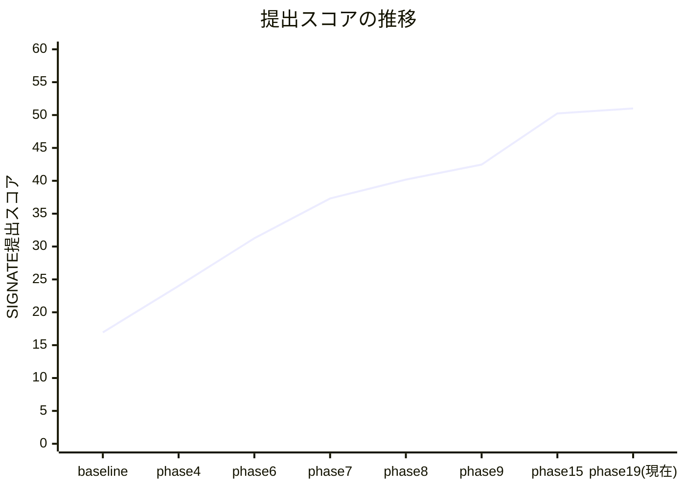
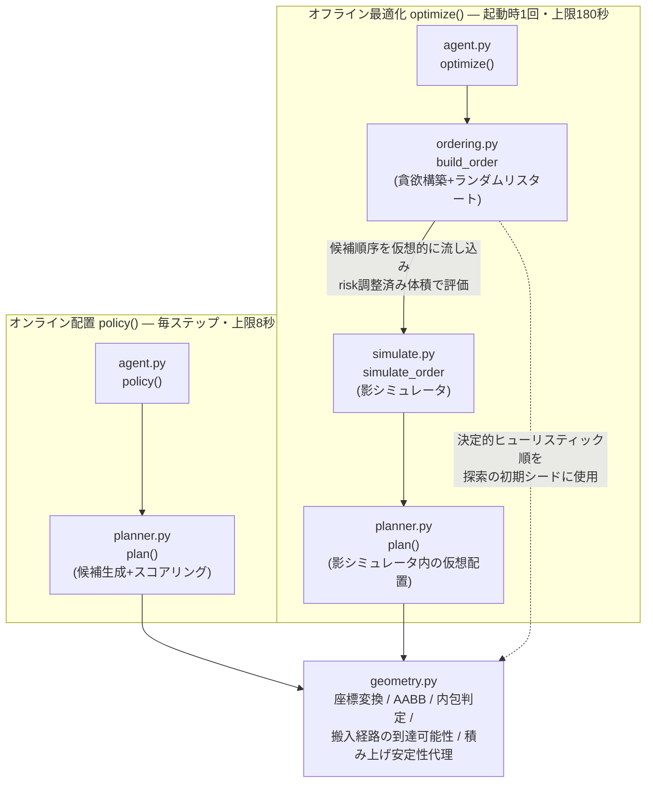

# 非凸コンテナ手荷物積付け最適化エージェント

NEDO Challenge コンテスト2「積付アルゴリズム」(SIGNATE)向けに開発した、空港手荷物を横空きコンテナへ自動積付けするエージェントの開発記録です。物理シミュレータ(PyBullet)上で合法手を保証しながら充填率・重心・安定性・優先荷物配置などの複数指標を最適化する探索アルゴリズムを、**仮説→検証→採否判定**のサイクルで19フェーズにわたり改善してきました。

本READMEは成果のハイライトです。各フェーズの詳細な仮説・実験・数値根拠は [`results/phase10_report.md`](results/phase10_report.md) 〜 [`results/phase19_report.md`](results/phase19_report.md) にすべて残しており、本文中の主張はすべてそこに1次データがあります(コードは評価基盤の性質上 `agents/mysolver/` を公開していますが、コンテスト公募要領そのものの転載は避けています)。

---

## 1. 概要

このコンテストの課題は、**非凸な形状のコンテナに、逐次到着する手荷物をオンラインで積み付ける**というものです。単純な3D Bin Packingと比べていくつかの点で難易度が高くなっています。

- **コンテナが非凸**: 横空き(手前に開口部)、内部に棚、斜めに切り欠かれた開口部など、単純な直方体ではない領域に対して合法配置を判定する必要があります。
- **到達可能性制約(搬入経路)**: 荷物は必ず手前の開口部からY軸方向→X軸方向へ「まっすぐ押し込む」軌道で搬入されます。目標位置が幾何学的に空いていても、そこへ至る経路上に他の荷物があれば配置は不合格になります。この制約は「体積が入るか」だけでなく「今どういう順序・配置で積んだか」全体の履歴に依存するため、素朴な貪欲法では自分自身の積み方で後続の搬入経路を塞いでしまう(自己封鎖)という罠があります。
- **Sudden death方式の評価**: 各ステップで内包判定・搬入経路判定・配置安定性判定のいずれか1つでも不合格になった瞬間にエピソードが終了し、その時点の状態で採点されます。1手の失敗が残り全荷物の機会損失に直結するため、「置ける手を確実に置ける形で選ぶ」保守性と「積極的に詰める」効率性のバランスが要求されます。
- **5指標のブラックボックス評価**: 最終スコアは充填率・重心・配置(優先荷物/ソフト貨物)・安定性の加重平均ですが、重みは非公開、配布されている評価コード(`src/ground_handling/evaluator.py`)も充填率しか算出しません。開発側は「何を最適化すれば本番スコアが上がるか」自体を実験的に推定する必要がありました。

これらの制約下で、**貪欲構築+リスタート探索によるオフライン順序最適化(`optimize`)**と、**候補生成+スコアリングによるオンライン配置決定(`policy`)**の二段構えのエージェントを実装し、探索の決定性・評価基盤の信頼性・目的関数の妥当性という3つの軸で継続的に検証・改善を行いました。

---

## 2. 成果

SIGNATE提出フィードバックで確認できたスコア推移です(リポジトリに記録が残っている提出のみを掲載。phase10〜14/16〜18は主にローカル評価スイートでの計測・仮説検証フェーズで、都度の提出は行っていません)。

| # | 提出スコア | 対応コミット | 主要な変更点 |
|---|---|---|---|
| 1 | 16.94 | baseline (`95de6e1`) | 合法貪欲ベースライン(候補生成+AABB近似の衝突判定) |
| 2 | 24.01 | phase4 (`467ae45`) | オフライン(影)物理シミュレーションで順序を事前検証 |
| 3 | 31.26 | phase6 (`d145aa3`) | 衝突判定バグ修正 + optimize予算30秒化 |
| 4 | 37.31 | phase7 (`4d8a1d7`) | 打ち切り考慮の順序探索 + リトライ機構 |
| 5 | 40.18 | phase8 (`fb8d80a`) | 体積(risk調整済み)優先の目的関数に回帰 — 足切り仮説を実測で棄却([§4-4](#4-技術的ハイライト)) |
| 6 | 42.47 | phase9 (`1ed528b`) | Y層規律 + 複数戦略の順序探索 |
| 7 | 50.25 | phase15完了時点 (`2689211`) | 26シーン評価スイート構築(phase10)、優先コンテナ席取り+prepacked fill回収(phase11)、corridor_penalty採用(phase14)、棚下/棚上コンパートメント分離(phase15)などの累積 |
| 8 | 51.00 | 現在, phase19 (`0462cf4`) | 決定性リファクタ(phase17)、到達不能候補の早期枝刈り+増分キャッシュ(phase19)などの累積 |



phase4〜7の間はローカルfillと提出スコアがほぼ線形に連動しており(`score ≈ 3×fill − 36`、`agents/mysolver/ordering.py` にこの回帰式を残している)、当初はローカルfillの改善だけを追っていれば良い状態でした。phase10で26シーン評価スイートを作って初めて、**固定6シーンでの改善が本番の出題分布に転移していない**(過適合)ことが判明し、以降は26シーン単位での評価に切り替えています([§4-3](#4-技術的ハイライト))。

---

## 3. アーキテクチャ



| モジュール | 役割 |
|---|---|
| `agent.py` | 評価基盤との契約点(`get_init_states`/`optimize`/`policy`)。`policy`は毎回`observation`から状態を再構築し、前ステップの内部記憶に依存しない(タイムアウト時にプロセスが再起動されるため)。 |
| `geometry.py` | ローカル/ワールド座標変換、回転後半寸法、内包判定、既配置荷物・棚のAABB算出(クォータニオンからの実姿勢考慮)、搬入経路の到達可能範囲の算出、積み上げ安定性の幾何代理(質量比・支持凸包へのCoG投影余裕)。 |
| `planner.py` | 候補位置生成(グリッド+Extreme Point)、着地面(skyline/union支持)判定、搬入経路の合法性フィルタ、スコアリング(`corridor_penalty`等)、探索打ち切りを管理する`SearchBudget`(ユニットベース予算)。オンライン・オフライン両方から呼ばれる中核モジュール。 |
| `ordering.py` | `optimize`用の完全順列を生成。決定的ヒューリスティック(体積降順など複数戦略)を初期シードに、`simulate.py`経由で評価しながら貪欲構築+ランダムリスタートで改善する。 |
| `simulate.py` | 実物理エンジンを起動せず`planner.plan`を仮想的に繰り返して候補順序のrisk調整済み体積を見積もる「影シミュレータ」。offline探索のコストを抑えつつ、実配置と同じ合法性判定ロジックで評価できる。 |
| `tools/scorer.py` | 開発時専用。配布評価コードが算出しないcog/stability/placement/soft_itemの4指標をREADME仕様に沿って近似算出するローカルスコアラー([§4-3](#4-技術的ハイライト))。 |
| `configs/gen/` | パターンA/B/C×コンテナ数×棚有無×優先コンテナ×初期状態(空/既積み)を網羅する26シーン評価スイートの生成物・生成スクリプト(`tools/gen_scenes.py`, `tools/gen_suite.py`)。 |

---

## 4. 技術的ハイライト

各項目は「問題 → 仮説 → 検証 → 結果」の順で記載しています。詳細な数値・生ログは各phase報告書にあります。

### 4-1. 搬入経路の自己封鎖の発見と corridor_penalty(物理式から不感帯を導出)

**問題**: 26シーン評価スイートでの停止理由の内訳を見ると、体積利用率20〜30%台のまま行き詰まるシーンの大半で`fail_transport_y`(搬入時のY方向掃引での衝突)が支配的だった。荷物は常に手前(y=−width/2)から入り、Y→Xの順で「まっすぐ押し込む」軌道でしか搬入できない。

**仮説**: 「手前側に高い荷物を積んでしまうと、その奥にある(まだ空いている)低い天面へアクセスする経路を自分自身で塞いでしまう(自己封鎖)」という仮説を立て、「手前ほど天面が低い階段状のプロファイルを保てば、奥への経路は原理的に塞がれない」という設計に落とした。

**検証**: 候補の天面が「同一Xレーンで自分より奥にある障害物の最低天面」を超える超過量にペナルティを課す`corridor_penalty`を実装。まず不感帯なしで決定的な5シーン(パターンB)で重みを掃引したところ、W=2.5で19.46、W=3.0で23.21、W=4.0で23.50と**カオス的に振れ、W>0全体の平均は無変更と統計的に区別できなかった**。原因を掃引の幾何計算式から追跡すると、実際には搬入経路がまだ生きている「物理的に無害な高さ差」の範囲が存在していた:

```
不感帯 = REST_CLEARANCE(0.016) + START_Z(0.08) − SWEEP_Z_MARGIN(0.0155) = 0.0805 [m]
```

この値は調整可能なハイパーパラメータではなく、着地面からの静定クリアランス・搬入時の浮上高さ・掃引時に要求されるz方向余裕という3つの物理定数から一意に決まる。不感帯を導入すると重み応答は滑らかな単峰カーブに変わり、W∈{3, 6, 12}のすべてで両レジーム(厳/緩マージンの充填率)が改善した。

**結果**: 26シーン×3回平均でfill_strict 22.39→23.33、fill_loose 36.62→37.16(いずれもノイズ床を超えて改善)。診断ツールで機序を直接確認したところ、`fail_transport_y`の発生率がB01で22.5%→3.1%、`gen_manyitems_patternA`で46.0%→15.7%に低下しており、「スコアが偶然良くなった」のではなく「詰まりが実際に減った」ことを裏づけた。その後、既積み荷物の層を過剰に保護してしまう副作用(prepackedシーンでのfill低下)が判明し、corridor_penaltyの障害物集合からエピソード開始時の既積み荷物を除外する修正で大部分を回収した。

### 4-2. 決定性リファクタ — 壁時計依存の非決定性を診断し、ユニットベース予算に置換

**問題**: オフライン探索(`ordering.build_order`)の打ち切り判定が`time.perf_counter()`ベースの壁時計デッドラインだったため、同一シーン・同一コードでもCPU負荷によって異なる乱数列・探索経路を辿ってしまい、A/Bテストの当落判定が困難だった(あるシーンを5回実行するとfill_strictのstdが5.25に達した)。予算(秒)を増やしても結果が単調に改善しない非単調性もあった(budget別スプレッド最大13.4pt)。

**仮説**: 打ち切り条件の表現を壁時計から「消費した評価コスト(ユニット)」の決定的な会計に置き換えれば、同一入力に対して常に同一出力になり、予算を増やせば以前の探索の"接頭辞"を保ったまま単調に深く探索できるはず。

**検証**: `planner.SearchBudget`という予算オブジェクトを導入し、候補評価・候補構築のコストを実測較正した換算定数(`UNITS_PER_SEC`, `CANDIDATE_BUILD_COST`)で秒→ユニットに変換。全階層(`_search_best`/`plan`/`simulate.simulate_order`/`ordering.build_order`)の打ち切りをユニット消費で統一し、壁時計は「較正」と「非常用の最終安全弁(本番タイムアウトを絶対に踏まないための保険)」の2用途のみに限定した。最初の実装(打ち切りだけ決定化)ではリスタート予算の配分自体が総予算に比例していたため、予算を変えると"別の探索系列"を辿ってしまい単調性は回復しなかった(スプレッドはむしろ5.33→6.76に悪化)。1リスタートへの配分を総予算に依存しない固定値にし、「満額の枠が入らないリスタートは始めない」ことで、予算違いのリスタート系列が互いに接頭辞になる構造を作って解決した。

**結果**: 同一シーンの5回追試で、fill_strict/fill_loose含む全6指標のstdが**5.25 → 0.0000**に(実所要時間は依然として最大約4割ばらついたが、出力は完全に一致した)。budget再掃引でのシーン単位スプレッド平均はstrict −58%/loose −65%、隣接予算間での非単調(悪化)回数はstrict −70%/loose −69%、21シーン中10シーンでスプレッドが厳密に0.00(=best-of-Nの理論通りの挙動)になった。副産物として計測コストが約1/3になり(3回平均が不要になりrepeats=1で十分)、以降のフェーズでより広い掃引・多くの候補比較に予算を回せるようになった。

なおこの決定性は、それまで乱数に埋もれて間欠的にしか現れなかった弱点(旧6シーンの1つで安定性制約97以上を96.87で恒常的に下回るケース)も同時に可視化した。原因は影シミュレータの目的関数が改善する一方で実際の充填率・安定性は悪化する順序に収束していたためで、「決定化が問題を作った」のではなく「代理目的関数の誤差を常時再現可能にした」というのが正確な整理である。

### 4-3. 評価がブラックボックスである中での自作5指標スコアラーと26シーン評価スイート構築

**問題**: 配布評価コード(`src/ground_handling/evaluator.py`)は充填率(fill_score)しか算出しない。本番の合成スコアは5指標(fill/cog/placement/soft/stability)の加重平均だが重みは非公開。さらに開発初期(phase4〜9)は固定6シーンのみで開発しており、シーンごとのばらつきや代表性を検証する手段がなかった。

**仮説**: (1) 固定6シーンは本番の出題分布より系統的に易しく、そこでの改善が本番へ十分転移していないのではないか(過適合仮説)。(2) fillの改善がcogの悪化で相殺されているのではないか(cogトレードオフ仮説)。

**検証**: README「評価指標」の定義に忠実な近似ロジックで自作5指標スコアラー(`tools/scorer.py`)を実装(fillは本家`Evaluator`をそのまま利用し、cog/stability/placement/soft_itemの4指標は独自に近似実装)。あわせてパターンA/B/C×コンテナ台数×棚有無×優先コンテナ×荷物数(6〜140)×分布(小物/高密度/柔軟貨物/優先重多 等)×初期状態(空/既積み)を網羅する26シーンの評価スイート(`configs/gen/suite_*.json`)を構築し、9シーン×5回計測で反復ノイズの床(fill ±0.90pt/cog ±0.67pt/stability ±0.09pt)も定量化した。

**結果**: 26シーン平均fillは16.33±4.59で、旧固定6シーン平均23.70±0.45より7.37pt低く、旧集合が系統的に易しかったことが実証された(過適合仮説を支持)。一方cogトレードオフ仮説は、提出履歴からの重み再構成でcog係数がbaseline1点の有無で+3.98→+0.48と激変することから支持されないと判定した([§4-4](#4-技術的ハイライト)にも関連)。以降のすべての意思決定はこの26シーンスイートを主KPIとして行っている。

### 4-4. 棄却した仮説の記録

失敗した仮説とその検証プロセスも、成功した変更と同じ重みで記録しています。

| 仮説 | フェーズ | 検証内容 | 結論 |
|---|---|---|---|
| **足切り仮説**: 「一定数以上積載しないとfill以外0点」という評価仕様から、まず配置個数の足切りラインを確保してから体積を最適化する二段階の目的関数が有効なはず | Phase7→8 | 実際に二段階目的関数で提出したが、スコアは動かなかった。回帰分析で公開スコアはローカルfillとほぼ線形(`score ≈ 3×fill − 36`)と分かり、個数ではなく体積が支配的だと判明 | **棄却**。体積(risk調整済み)優先の目的関数へ差し戻し |
| **cogトレードオフ仮説**: fillの改善がcogの悪化で相殺され、公開スコアが伸び悩んでいる | Phase10 | 提出履歴6点の重み再構成でcog係数+3.98を得たが、baseline 1点を除いた5点では+0.48まで激減。stab/place/softは全提出でほぼ一定で識別に寄与せず | **支持されない**。公開スコアはfillでほぼ説明でき、cogの独立寄与は誤差と不可分 |
| **Y_SLICE構造(奥/手前の層分割)への介入**: 層の開放条件を変えれば搬入経路の詰まりを解消できる | Phase9, 13, 14 | 固定4分割(Phase9・小物が最も狭い層を埋めて逆効果)、到達高さでの強制開放(Phase13・奥半分を使い切る前に手前へ展開)、棚シーンでの分割無効化(Phase14・標的シーン自身が悪化)を試し、**3回とも悪化して差し戻し** | **3連敗で打ち切り**。「探索構造をいじるより、スコアリングに罰則項として載せる方が安全」という設計方針を得た(4-1のcorridor_penaltyが対照的に成功した理由) |
| **単一大域重みによるstability幾何代理の較正**: 質量比リスク・CoG投影余裕を目的関数に組み込み、1つの重みで安定性制約違反を解消できる | Phase18 | 標的シーンではW=2.5で制約を回復したが、26シーン過適合チェックで無関係シーンのfillが−18.36・placementが制約違反(100→85.71)に悪化。さらにW=1.1→1.2で標的シーンが修正される一方、別シーンはW=1.1の時点で既に破綻しており、**両方を同時に満たす重みの区間がそもそも存在しない**(崖の位置がシーン間で逆転) | **単一大域重みでは較正不能と判断し不採用**。デフォルト重みを0(数式的に旧実装と完全等価なno-op)に戻し、trust region + ρ-testのような候補ごとのgating設計を次フェーズへ申し送り |
| **空き62%は細切れの空隙で、探索の解像度を上げれば拾える**: 行き詰まり時の空き体積は小さなポケットの集合で、グリッド密度を上げれば入る荷物が見つかるはず | Phase22 | 空き連結成分は26シーンで36個・中央値2.18m³・全て1.0m³以上=**細切れではなく1つの大きな空洞**。さらに強い探索が拾えた6.932m³は、**密度4のままでも全量到達可能**(解像度は律速でない)で、poolをlookahead_k個に制限すると**69%が消失**=正体は荷物選択の自由度だった。26シーンA/Bでも密度4→8は改善0/悪化3 | **両方とも棄却**。細切れ前提の打ち手は対象が存在せず、解像度引き上げは予算を食って逆効果。取りこぼしは順序側でしか回収できないと確定 |
| **計上漏れ36%は未開拓のレバー**: 置けた体積の36%が充填率に計上されていないので、これを回収すれば大幅に伸びる | Phase21 | 26シーン574件の全数監査で原因を体積分解した結果、**96.4%が「床直置き」という構造的要因**(床面が99.7%)。傾き・棚接触・押し出しは**すべて0.0%**。床層は土台として幾何的に必要で、最薄構成の下界13.3m³に対し目標0.85は8.1m³を要求 → **幾何的に到達不能**。残る上限+4.24ptの機序(薄物を床へ)も手組み順序の実測で棄却(置けた体積が29%崩壊) | **「レバー」ではなく指標の構造と判明**。充填率 ≒ 置けた体積 × 0.63 で、計上率は独立に動かせない。この方向を打ち切り、レバーは「置けた体積を増やすこと」に戻ると確定 |
| **代理関数の較正を直せば探索の質が上がる**: 影シミュレータのfill計上予測を物理的に正しい「沈降後の姿勢」で評価し直せば、目的関数が実評価に近づき順序選択が改善する | Phase20 | 較正は劇的に改善(計上割合の誤差 +0.141→−0.049、fillの系統バイアス +4.02pt→−1.75pt)。**しかし順位相関は改善せず**(native Spearman 0.710→0.690、改善は8シーン中2つ)。原因を分解して特定: 代理誤差は「シーンごとの一定の下駄(較正誤差)」と「候補ごとのばらつき(弁別誤差)」からなり、修正が消したのは前者だけ(**弁別誤差 0.075→0.075 と不変**)。`build_order`は同一シーン内の順位しか使わないため、全候補共通の下駄は定義上どんな決定も変えない | **不採用**(26シーンでfill_strict +0.13=ノイズ内、fill_loose −1.00、stability新規違反)。同時に「**risk_factorの定数・形状をどう調整しても順位は改善しない**」という構造的結論を得て、代理関数改良路線そのものを打ち切り |

途中で一度「本番評価のinclusion_marginレジーム(厳/緩)を提出フィードバックとの突き合わせで確定した」と結論したことがありましたが(Phase12)、後にその根拠が自分たちの過去のローカル計測値との**循環参照**だったと気づき撤回しました(Phase13)。以降は「レジームが判別できない前提でも両方(fill_strict/fill_loose)とも改善する変更だけを採用する」という、ブラックボックスに対して頑健な意思決定基準に切り替えています。

### 4-5. 評価指標の構造そのものを測る: fill計上漏れの原因分解(Phase21)

**問題**: 「置けた体積のうち充填率スコアに計上されるのは0.629」——約36%が計上されていない。額面どおりなら最大のレバーに見える。

**仮説**: 計上漏れの原因を(a)床直置き (b)沈降後の傾きによる壁・天井への接触 (c)棚接触 (d)他の荷物に押されての移動 に分解すれば、狙って潰せるはず。

**検証**: 配布評価コードの判定式(荷物の8角点×コンテナ7面の内積)を再現し、26シーン・配置済み574件を全数監査。「どの面をどれだけ超えたか」で相互排他に分類し、**件数ではなく体積シェア**で集計しました(充填率は体積ベースのため)。

**結果**: 原因は極端に一極集中していました。**(a)床直置きが96.4%**、面別では**床面が99.7%**。一方 **(b)傾きは0.0%** — これは「小さい」のではなく原理的に起きていません(574件の傾き角は最大3.72°、5°以上は0件、天井・切り欠き・側壁による除外は1件も無い)。機序も厳密に特定できました: 床面の判定は `dot = thickness − bottom_z` なので、軸平行の荷物が内床面に接地すると `dot = 0` となり `0 > −0.005` で必ず除外される。**計上されるには床から5mm以上浮いている必要があり、物理沈降は必ず支持面まで落とすため床接地荷物は構造的に永久に計上されません。**

この分解は、当初の見立て自体を否定しました。床層は積み上げの土台として幾何的に必要で、実測の被覆率(53.3%)を維持したまま手持ちの最も薄い荷物で床を作った場合の**下界が13.3m³**。「計上率0.85」は床層8.1m³を要求するので**幾何的に到達不能**であり、36%のうち約2/3は削減不能な土台コストでした。残る上限+4.24ptを取りにいく唯一の機序(薄い荷物を床に、厚い荷物を上へ)も、**エージェント無改造のまま手組み順序を実エピソードに流して直接検証し棄却**しました(床層は薄くなるが置けた体積が2.491→1.768m³に崩壊し、充填率は改善しない)。結論として、充填率スコアは実質「置けた体積 × ほぼ一定の係数0.63」であり、計上率は独立に動かせるレバーではないと確定しました。

### 4-6. 空き体積62%の分解と、自分の仮説を測定で否定した話(Phase22)

**問題**: 充填率スコアの唯一のレバーが「置けた体積」に絞られた結果(Phase21)、体積利用率37.8%の裏返しである**62%の空き**が次の標的になりました。これは埋められる空隙なのか、それとも埋まらない空間なのか。

**仮説**: 空き体積を(a)搬入経路が塞がれて到達不能 (b)どの荷物も入らない細切れの空隙 (c)入る荷物があるのに探索が見つけられなかった (d)コンテナ形状で構造的に使えない に分解すれば、打ち手が決まるはず。

**検証**: 行き詰まり状態を2.5cm voxelに離散化し、残荷物×全向きについて3D積分画像で「その直方体が完全に空voxelへ収まる位置」を全列挙して、`covered`⊇`supported`⊇`reachable`の入れ子マスクを構成しました(膨張は累積和による分離可能な窓走査でO(N))。**(c)だけはvoxel近似ではなく production の実コード `planner.plan` で測定**しています——「置けるはず」と近似で主張するより、実際の合法性判定コードで置けることを示すほうが証拠として強いためです。独立な2経路(voxel由来の上界0.08m³ / 実コード実測0.074m³)が一致したことで測定機構の妥当性も確認できました。

**結果**: まず**空隙の形状についての仮説が外れました**。空き連結成分は26シーンで**わずか36個**、中央値2.18m³、全成分が1.0m³以上——**細切れではなく、コンテナごとに1つの大きな空洞**でした。「細切れを埋める」系の打ち手は対象が存在しません。

そしてより重要なこととして、**自分の一次解釈を追試で否定しました**。強い探索が追加配置できた6.932m³(+4.82pt)を当初「グリッド解像度の取りこぼし」と解釈し、単一定数`RETRY_GRID_DENSITY`の引き上げを検証にかけました。しかし採用判断の前に内訳を切り分けたところ、**密度4のままでも同じ6.932m³に到達でき(解像度は律速ではない)**、一方で**pool を online と同じlookahead_k個に制限すると69%が消える**ことが判明しました。つまり取りこぼしの正体は「どの荷物を置くか選べる自由度」であり、オンライン探索をどう強化しても原理的に取れず、順序側でしか回収できません。26シーンA/Bでも密度引き上げは改善0/悪化3で不採用となり、コードは既定値のまま据え置きました。

副産物として理論上界も算出しました。`min(幾何上限97.8%, 荷物供給量)`で集計すると実効上界は**90.4%**(荷物供給が律速のシーンが26中10件)。現状の37.8%は**上界の41.8%**の位置にあります。

### 4-7. 到達点: 到達不能候補の早期枝刈り+増分キャッシュ(Phase19)

**問題**: 決定性リファクタ後の実測較正(Phase17)で、候補生成(`_candidate_xy`)がplan()時間の58%を占め、候補評価(`_evaluate_candidates`)より重いことが分かった。

**仮説**: (1) 候補の(x,y)によらず一意に定まる搬入スイープ高さの範囲が、既存障害物のz遮断区間で完全に覆われている候補は、着地面の詳細評価より前の段階で厳密に(近似なしで)判定・除去できる。(2) グリッド点集合・既配置荷物のAABB・障害物リストは値ベース/増分キャッシュ化すれば、候補集合を数学的に一切変えずに構築コストだけ下げられる。

**検証**: (1)は24000件の合成ランダムケースで不一致0件、決定的な5シーンでエピソード全体のsha256 digestが完全一致することを確認。(2)は旧6シーン全11通り(offline最適化を経由するシーンを含む)でdigest完全一致を確認 — いずれも「出力を一切変えない厳密な最適化」であることを構成的に保証した。

**結果**: 清浄なワークロードでplan()時間 −21.2%(枝刈りのみ)、さらに枝刈り+キャッシュで −29.0%。この速度改善を踏まえてユニット予算の較正定数(`UNITS_PER_SEC`)も再較正したところ、片方だけの変更は安全な一方、**2つの定数を同時に変更した場合だけ**無関係シーンのplacementを制約違反に落とす「組み合わせの崖」を新たに発見した(単一パラメータの崖より一段厄介な現象)。指示範囲外だった定数の変更は見送り、範囲内の再較正のみを採用する保守的な判断をした。26シーン最終確認ではplacement/soft満点・stability全シーン97.26以上を維持しつつcogが+0.72改善。ただし速度改善分がそのままfillの明確な改善には直結しなかった(ノイズ床以内)ことも正直に記録している。

---

## 5. 開発方法論

- **診断駆動開発**: `tools/diagnose_placement.py`・`diagnose_prepacked.py`・`diagnose_shelf_zones.py`・`diagnose_stall.py`など、実際にエピソードを再現・走査して「なぜ失敗するか」を数値(内訳・件数)で特定してから修正する運用を徹底しました。スコアの動きだけを見て場当たり的にパラメータを触ることはしていません。
- **決定的シーンでの先行検証 → 26シーン統計検証の2段階プロトコル**: Phase13で「offline optimizeが有効なシーンは単発計測でstd ±5〜10ptに達する」ことを発見して以降、まず`optimize`無効(決定的)なシーンで重み掃引・仮説の方向性を確認し、方向性が出たものだけ26シーン評価スイートで最終判定する、という2段構えを標準化しました。Phase17の決定性リファクタ後は「repeats=1で十分・repeats=2は異常検知(較正が想定と乖離していないかの見張り)」という形にさらに進化しています。
- **ノイズ床の概念**: 9シーン×5回計測(Phase10)で「これ未満の差は意味を持たない」閾値(fill ±0.90pt / cog ±0.67pt / stability ±0.09ptなど)を確立し、以降すべての当落判定の基準にしています。26シーン平均でも別途ノイズ床を実測(Phase14)し基準を更新しています。
- **1提出=1変数の原則**: 複数の変更を1つのコミット/提出にまとめず、各フェーズで単一のターゲット(仮説)を検証してから次に進みます。旧6シーンでの局所的な改善だけで採否判断をせず、必ず26シーンスイートでの過適合チェックを通す運用を徹底しました(Phase18のように、旧6シーンだけなら成功に見えた変更を26シーンで検出して不採用にした例が複数あります)。

---

## 6. 学んだこと/今後の課題

**代理目的関数と真の評価の乖離**が、現在向き合っている中心的な課題です。オフライン探索(`ordering.build_order`)が最適化しているのは影シミュレータ上の「risk調整済み体積」であり、本番の合成スコアそのものではありません。Phase17でこのギャップが単一シーンで再現可能な形になり(安定性制約違反として顕在化)、Phase18で「単一の大域重みでこの誤差を埋めようとする」試みが、シーンごとに崖の位置が異なるため破綻することを実証しました。

Phase20では、この乖離を推測ではなく**直接測定**しました。8シーン×125候補について「影シミュレータの予測」と「その順序を実際に走らせた真のfill」を対にして計測した結果、順位相関はSpearman 0.710(探索が実際に評価する候補集合)、誤差の系統成分はほぼ全量が「置けた体積のうちfillに計上される割合」の過大評価(予測0.779 vs 実測0.638、8/8シーンで同符号)に由来すると特定できました。同時に、候補間の真のfillスプレッドが平均19.19ptと大きいことから「順序を変えても結果が変わらないから探索改善が効かなかった」という対立仮説は棄却されています。

ただしこの測定は、**修正の方向が誤っていたこと**も同時に明らかにしました。物理的に正しい「沈降後の姿勢」で計上を評価し直すと較正は大幅に改善するのに、順位相関はまったく改善しません。代理誤差を「シーンごとの一定の下駄(較正誤差)」と「候補ごとのばらつき(弁別誤差)」に分解すると、修正が消したのは前者だけで、後者は0.075→0.075と1ミリも動いていませんでした。探索は同一シーン内の順位しか使わないため、全候補に共通の下駄は原理的にどんな決定も変えられません。**代理関数をより正確にするという路線自体が意思決定を改善しない**、というのが現時点の結論です。

Phase21では視点を変え、代理関数ではなく**評価指標そのものの構造**を測りました。「置けた体積の36%が計上されていない」という一見最大のレバーを26シーン574件の全数監査で分解した結果、96.4%が「床直置き」という構造的要因で、傾き・棚接触・押し出しはいずれも0.0%でした。さらに床層は土台として幾何的に必要なため、目標としていた計上率0.85は幾何的に到達不能で、残る上限を取る唯一の機序も実測で棄却されました。つまりこれはレバーではなく指標の性質であり、**充填率スコア ≒ 置けた体積 × ほぼ一定の係数0.63**という関係に整理されました。

Phase20・Phase21を通じて、「代理関数を正確にする」「計上率を上げる」という2つの迂回路がどちらも閉じ、残るレバーは**置けた体積そのものを増やすこと**に絞られました。Phase22ではその裏返しである「空き62%」を分解し、空隙が細切れではないこと、そして取りこぼしの正体が探索の解像度ではなく**荷物選択の自由度**——すなわち順序——であることを突き止めました。

現時点で独立な2つの測定が同じ方向を指しています。Phase20の「候補順序による実充填率スプレッドが平均19.19pt、順位相関0.710」と、Phase22の「取りこぼしの7割が荷物選択の自由度由来」です。したがって次の焦点は**順序探索の候補生成そのもの**になります。ただしPhase20で候補の*選び方*(代理関数の較正、ρ-testの天井1.14pt)は既に閉じているため、狙うべきは候補の*作り方*——`greedy_construct_order`が生成する順序の多様性と質です。Phase19で得た高速化の余力(plan()時間−29%)をここに充てるのが筋だと考えています。あわせて、空きの26.7%を占める搬入経路(corridor_penalty系のスコア調整)も未着手のまま残っています。

その他、副産物として得た教訓:

- **評価のブラックボックス性への向き合い方**: 一度「本番のinclusion_marginレジームを確定した」と結論しましたが(Phase12)、根拠が自分たちの過去のローカル計測値との循環参照だったと気づき撤回しました(Phase13)。以降は「両レジームとも改善する変更だけを採用する」という頑健な基準に切り替えています。誤りに気づいて訂正した記録も、報告書にそのまま残しています。
- **探索パラメータは連続的なダイヤルではない**: 貪欲構築+リスタートという離散探索に対して、目的関数の重みは「どの局所解に落ちるか」を切り替えるスイッチとして作用します(Phase14/16/18/19で繰り返し観測)。単一シーンでの重み調整結果を鵜呑みにせず、必ず複数シーン・複数水準で検証する必要があります。
- **測定できないものは改善できない、が「測れた」だけでも足りない**: Phase20で代理誤差を厳密に測れるようにしたこと自体は前進でしたが、測った量(系統バイアス)と意思決定を左右する量(候補間の順位)が別物だったため、バイアスを直しても結果は動きませんでした。最適化器が実際に何を使っているか(ここでは順位のみ)から逆算して測定対象を選ぶ必要があります。
- **「改善余地の大きさ」自体を先に測ると、無駄な実装を省ける**: Phase21では修正に着手する前に上限を計算し(最薄構成の下界)、さらにその上限を実現する機序をエージェント無改造の手組み順序で直接検証しました。結果として目標が幾何的に到達不能であることと機序が成立しないことが分かり、コードを1行も変えずに方向転換できました。傾き対策のように「実測で発生件数が0」と分かった施策は、実装しても定義上効果がありません。
- **自分の一次解釈を、採用前に切り分けて否定する**: Phase22では取りこぼし6.932m³を「グリッド解像度の問題」と解釈して単一定数の変更を検証にかけましたが、採用判断の前に内訳を分解したところ、解像度は律速ではなく荷物選択の自由度が本体だと判明しました。もし切り分けずに26シーンA/Bの結果(改善0/悪化3)だけを見ていたら「効果がなかった」で終わり、**なぜ効かなかったのか=どこにレバーがあるのか**という次に繋がる情報は得られませんでした。
- **未解決の課題**: 旧6シーンの1つ(`gen_2containers_priority`)の安定性制約違反(Phase17以降未解決)、順序探索の候補生成の改善(Phase20・Phase22が同じ方向を指す最優先課題)、空きの26.7%を占める搬入経路のスコア調整。本番の内包判定レジーム(厳/緩)が未確定で、緩なら計上漏れは0.7%しかなくPhase21の分析対象そのものが消える点も継続課題です。

---

## 7. 技術スタック

- **言語/ランタイム**: Python 3.12
- **物理シミュレーション**: PyBullet 3.2.7(Gymnasium準拠のconfig駆動環境。評価基盤と同一のx86_64 Ubuntu 24.04コンテナ上で検証)
- **環境インタフェース**: Gymnasium 1.2.3
- **数値計算**: NumPy(幾何演算・候補生成のベクトル化、探索コストの大半を占める処理を配列演算化)
- **開発/実行環境**: Docker(`docker-compose.yml` で評価基盤と環境を一致させて開発)
- **自作ツール群**: 5指標近似ローカルスコアラー(`tools/scorer.py`)、26シーン評価スイートジェネレータ(`tools/gen_scenes.py`, `tools/gen_suite.py`)、診断ツール群(`tools/diagnose_*.py`)、決定性検証ツール(エピソード全体のsha256 digest比較、`tools/phase17_dump.py`)、コスト較正ツール(`tools/phase17_probe.py`)

---

## 開発運用ルール(このリポジトリでの作業指示)

新しいPhaseの作業が完了しコミットする際は、**必ず本README.mdも同じコミットに含めて更新すること**(`git add -A && git commit` で一緒に)。具体的には:

1. 「[2. 成果](#2-成果)」のスコア推移表に、新しい提出結果があれば追記する(提出していないPhaseは追記不要)。
2. 「[4. 技術的ハイライト](#4-技術的ハイライト)」に、そのPhaseが構造的な発見・重要な仮説検証をもたらした場合のみ追加する(平凡なパラメータ調整の追記は不要)。棄却した仮説も同様に、構造的な学びがあれば§4-4の表に追記する。
3. 「[6. 学んだこと/今後の課題](#6-学んだこと今後の課題)」を現状(未解決課題・直面している問題)に合わせて更新する。

このルールは恒久的なものとして扱うこと。
